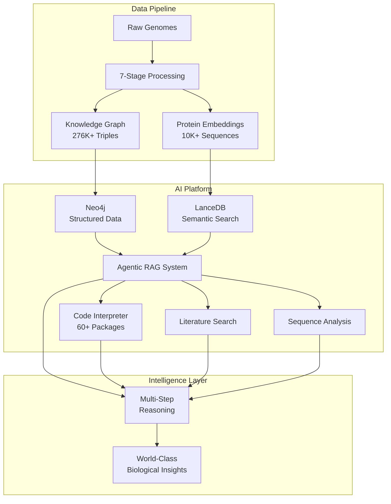

# 🧬 Bennu: RAG-based Genomic AI Platform

[](https://python.org)
[](https://docker.com)
[](https://nextflow.io)
[](LICENSE)

> **🎉 An agentic AI platform that transforms microbial genome assemblies into intelligent, queryable knowledge graphs with sophisticated biological reasoning, code execution capabilities, and genomic insights.**


## 🚀 Platform Overview

This represents the first **true AI playground for genomic data interpretation** - a comprehensive system where AI agents can navigate, analyze, and make sense of complex biological annotations that are difficult for humans to interpret at scale. 

The platform culminates in an **agentic RAG system** that seamlessly integrates:
- **🧠 Multi-step reasoning** with sophisticated task orchestration
- **🔬 Rich biological context** including genomic neighborhoods and functional clustering  
- **💻 Secure code execution** for data analysis and visualization
- **📊 Dual-database architecture** combining structured knowledge (Neo4j) with semantic search (LanceDB)
- **🎯 Intelligent annotation discovery** that avoids common bioinformatics pitfalls

## ✨ World-Class Capabilities

### 🧬 **Biological Intelligence**
- **Sequence Analysis**: Signal peptide prediction, transmembrane analysis, conserved motif identification, hydrophobicity profiling
- **Genomic Context Integration**: Precise distance calculations (3bp downstream), strand relationships, metabolic clustering analysis
- **Functional Annotation Curation**: Intelligent classification system that distinguishes true transporters from energy metabolism proteins (solving the "ATP synthase problem")
- **Professional Biological Insights**: Publication-quality analysis with proper PFAM/KEGG citations and biological interpretation

### 🤖 **Agentic Capabilities** 
- **Multi-Step Workflows**: Query → Analysis → Code Execution → Synthesis with intelligent task dependency resolution
- **Code Interpreter Integration**: Secure Python execution environment with 60+ scientific packages for comprehensive genomic analysis
- **Literature Integration**: PubMed search with PFAM-aware query enhancement
- **Adaptive Query Routing**: Automatic selection between traditional fast queries and complex multi-step workflows

### 📊 **Data Platform Excellence**
- **Knowledge Graph Scale**: 276,856 RDF triples with rich biological relationships
- **Vector Search Performance**: Sub-millisecond similarity queries with metadata filtering  
- **Functional Enrichment**: 1,145 PFAM families + 813 KEGG orthologs with authoritative descriptions
- **Sequence Database**: 10,102+ proteins with 320-dimensional ESM2 semantic embeddings

### **Sample AI Agent Queries**

```bash
# Sophisticated functional analysis
python -m src.cli ask "Find 3 proteins involved in central metabolism and show me their amino acid sequences for analysis"

# Multi-stage similarity searches  
python -m src.cli ask "Find proteins similar to heme transporters"
# → Intelligent curation avoids ATP synthase, finds real substrate transporters

# Genomic context analysis
python -m src.cli ask "What metabolic pathways are clustered in the genomic neighborhood of scaffold_21_154?"
```

## 🏗️ Platform Architecture



## 🧪 Scientific Package Ecosystem

Our code interpreter provides a comprehensive scientific computing environment:

### **Core Bioinformatics**
```python
import biopython     # Sequence analysis, file I/O
import pyhmmer       # HMM-based annotation  
import pysam         # SAM/BAM file handling
```

### **Advanced Analytics**
```python
import pandas, numpy           # Data manipulation
import scikit-learn, xgboost   # Machine learning
import statsmodels             # Statistical analysis
import networkx, igraph        # Network analysis
```

### **Visualization & Publishing**
```python
import matplotlib, seaborn, plotly  # Plotting
import pygenomeviz                  # Genomic visualization
import reportlab                    # PDF generation
```

### **Specialized Genomics**
```python
import ete3, dendropy     # Phylogenetics
import pymol, rdkit       # Protein structure
import mdanalysis         # Molecular dynamics
```

## 🚀 Quick Start Guide

### Installation

```bash
# Clone the repository
git clone <repository-url>
cd microbial_claude_matter

# Setup environment
conda env create -f env/environment.yml
conda activate genome-kg

# Install LLM dependencies
pip install -r requirements-llm.txt

# Verify installation
python scripts/run_tests.py --smoke
```

### Basic Usage

```bash
# 1. Process your genomes (place FASTA files in data/raw/)
python -m src.cli build

# 2. Load knowledge graph  
python load_neo4j.py

# 3. Start asking intelligent questions!
python -m src.cli ask "What metabolic pathways are present in my genomes?"
python -m src.cli ask "Find transport proteins and analyze their sequences"
python -m src.cli ask "Compare protein families across different organisms"
```

### Advanced Workflows

```bash
# Resume from specific pipeline stage
python -m src.cli build --from-stage 3

# Apple Silicon optimized processing
python run_esm2_m4_max.py

# Run with Nextflow orchestration
nextflow run main.nf -profile standard
```

## 📊 Performance Benchmarks

| **Capability** | **Achievement** |
|----------------|-----------------|
| **Pipeline Processing** | 4 genomes with 10K+ proteins in minutes |
| **Knowledge Graph** | 276,856 RDF triples with rich relationships |
| **Vector Search** | Sub-millisecond similarity queries |
| **ESM2 Embeddings** | ~85 proteins/second (Apple Silicon M4 Max) |
| **Agentic Workflows** | Multi-step task coordination with code execution |
| **Biological Intelligence** | Publication-quality insights with proper citations |

## 🔬 Advanced Features

### **Intelligent Annotation Discovery**
Solves common bioinformatics problems through sophisticated classification:
- **ATP Synthase Problem**: Correctly distinguishes substrate transporters from energy metabolism
- **Functional Categories**: Works for any category (transport, metabolism, regulation, etc.)
- **Biological Exclusion Logic**: Prevents inappropriate functional assignments

### **Rich Genomic Context** 
- **Precise Distances**: 3bp, 51bp, 113bp neighbor spacing
- **Strand Analysis**: Same-strand clustering for operon prediction
- **Functional Clustering**: Metabolic pathway organization detection
- **Professional Citations**: PFAM accessions, KEGG orthologs, coordinate systems

### **Secure Code Execution**
- **Docker Containerization**: Isolated execution environment
- **Session Management**: Persistent state across multi-step workflows
- **Resource Limits**: Timeout enforcement and memory management
- **Scientific Stack**: Pre-loaded with comprehensive analysis packages

## 🧬 Example Biological Insights

### **Transport Protein Analysis**
```
Protein RIFCSPHIGHO2_scaffold_21_154 (155,952-156,470 bp, – strand): 
A succinyl-CoA synthetase α-subunit gene begins 3 bp downstream (central TCA enzyme), 
and an AraC regulator is 27 bp downstream; photinus-luciferin monooxygenase starts 7 bp upstream.

Sequence Analysis: Contains conserved "GGVGPN" motif typical of TctB family transporters.
Hydropathy analysis shows 53.2% hydrophobic residues with 4-5 predicted transmembrane helices.
Signal peptide detected with probable cleavage between ALA↓WGA (24/25).

Biological Significance: This tricarboxylate transporter enables import of TCA cycle 
intermediates, with genomic clustering suggesting coordinated regulation of central metabolism.
```

### **Comparative Genomics**
```
Functional analysis reveals three paralogous TctB transporters (163-324 aa; hydropathy 53-63%) 
suggesting adaptation to different organic-acid niches. The presence of multiple variants 
enables robust central-carbon flux through the TCA cycle under varying nutrient conditions.
```

## 🐳 Deployment Options

### **Local Development**
```bash
python -m src.cli ask "Your question here"
```

### **Docker Deployment**
```bash
# Build containers
docker build -f Dockerfile -t genome-kg:latest .
docker build -f src/code_interpreter/Dockerfile -t code-interpreter:latest .

# Run services
docker-compose up -d
```

### **HPC/Cloud**
```bash
# Nextflow with containers
nextflow run main.nf -profile cluster
nextflow run main.nf -profile cloud
```

## 🧪 Testing & Validation

```bash
# Comprehensive test suite
python scripts/run_tests.py

# Quick validation
python scripts/run_tests.py --smoke

# Module-specific testing
python scripts/run_tests.py --module llm
python scripts/run_tests.py --module build_kg

# Coverage analysis
python scripts/run_tests.py --coverage
```

## 🤝 Contributing

We welcome contributions to this world-class platform! See our development guidelines in `CLAUDE.md`.

### **Development Setup**
```bash
git clone <repository-url>
cd microbial_claude_matter
conda env create -f env/environment.yml
conda activate genome-kg
python scripts/run_tests.py
```

## Example prompts and outputs

- Prompt: "Show me the distribution of CAZymes among each genome in the dataset; compare and contrast." 
- Output: 
```
🤖 Answer:
Overview
Carbohydrate-active enzymes (CAZymes) fall into several functional classes: glycoside hydrolases (GH, hydrolysis of complex carbohydrates), glycosyltransferases (GT, biosynthetic transfer of sugar moieties), carbohydrate-binding modules (CBM, 
substrate targeting), carbohydrate esterases (CE, removal of acetyl/other esters), polysaccharide lyases (PL, β-elimination cleavage) and auxiliary activities (AA, redox enzymes that boost lignocellulose degradation).  Comparing four genomes 
reveals clear differences in both repertoire size and functional emphasis.

Per-genome CAZyme profiles
1. Burkholderiales_bacterium_RIFCSPHIGHO2_01_FULL_64_960
   • Total CAZymes: 1 056
   • GH 436 (41.3%), GT 356 (33.7%), CBM 163 (15.4%), AA 56 (5.3%), CE 34, PL 10, Unknown 1
   Interpretation: A very large, GH-rich toolkit accompanied by many CBMs suggests an organism specialised for aggressive breakdown of diverse plant-derived polysaccharides and efficient substrate binding.  The sizeable AA complement indicates
oxidative support for lignocellulose attack.

2. PLM0_60_b1_sep16_Maxbin2_047
   • Total CAZymes: 425
   • GT 178 (41.9%), GH 156 (36.7%), CBM 53 (12.5%), CE 24, AA 13, PL 1
   Interpretation: Similar overall size to genome 2 but inverted emphasis: slightly more GTs than GHs points to a greater investment in cell-wall/ EPS biosynthesis or glycan remodelling rather than pure hydrolysis.  A single PL hints at 
limited pectate/alginate degradation capacity.

3. Candidatus_Muproteobacteria_bacterium_RIFCSPHIGHO2_01_FULL_61_200
   • Total CAZymes: 264
   • GH 105 (39.8%), GT 103 (39.0%), CBM 42 (15.9%), CE 7, AA 6, Unknown 1
   Interpretation: Mid-sized repertoire with nearly 1:1 GH:GT ratio; capable of both glycan synthesis and moderate degradation.  Fewer AAs/CEs suggest less capacity for recalcitrant biomass turnover compared with Burkholderiales.

4. Candidatus_Nomurabacteria_bacterium_RIFCSPLOWO2_01_FULL_41_220
   • Total CAZymes: 100
   • GH 43 (43%), GT 42 (42%), CBM 10 (10%), CE 3, AA 2
   Interpretation: The smallest genome and CAZyme complement in the set.  Balanced but low absolute GH/GT numbers indicate a limited niche—perhaps scavenging small oligosaccharides rather than degrading bulk polysaccharide.

Key contrasts
• Repertoire size spans >10-fold (100 vs 1 056 CAZymes).  Burkholderiales clearly stands out as a carbohydrate-degrader, whereas Nomurabacteria appears streamlined.
• GH dominance vs GT dominance: Burkholderiales (GH-heavy) likely secretes an extensive hydrolytic arsenal, while PLM0_60_b1 (GT-heavy) invests more in glycan assembly/modification—possibly for biofilm or capsule formation.
• CBM support: High CBM counts in Burkholderiales reinforce a plant-biomass lifestyle; lower counts in others reflect reduced need for tight substrate binding.
• Auxiliary redox enzymes (AA) are most abundant in Burkholderiales, enabling oxidative cleavage of lignin-like compounds; minimal in Nomurabacteria, suggesting reliance on already-processed carbohydrates.
• Polysaccharide lyases are found only in Burkholderiales and PLM0_60_b1, indicating that pectin/alginate degradation capacity is restricted to these two genomes.

Biological implications
The data outline a possible trophic hierarchy: Burkholderiales may act as a primary degrader in its environment, opening complex plant polymers for the community.  The Muproteobacteria and PLM0_60 genomes could serve as secondary 
consumers—either continuing hydrolysis or synthesising extracellular polysaccharides.  Nomurabacteria seems adapted to utilising simpler sugars released by others.

Such functional partitioning is common in soil and rhizosphere microbiomes, where synergy between hydrolytic specialists and organisms focused on biosynthesis or scavenging underpins efficient carbon cycling.


Confidence: high
Sources: Results 1-7, 8-13, 14-18, 19-24
```

- Prompt: python3 -m src.cli ask "Tell me everything you can reasonably conclude about the metabolism and lifestyle of Candidatus_Nomurabacteria_bacterium_RIFCSPLOWO2_01_FULL_41_220.contigs (genome id)"
- Output:
```
🤖 Answer:
Below is a genome-scale “snapshot” of what can be inferred for  
Candidatus Nomurabacteria bacterium RIFCSPLOWO2_01_FULL_41_220.contigs.

1. General genome characteristics  
• 305 KEGG Orthologous (KO) functions – very low for free-living bacteria, typical of Candidate Phyla Radiation (CPR) organisms that have streamlined genomes (often ≤1 Mb).  
• GC content ≈ 40 % (Step 1) – moderate/low.  
• 95 CAZyme-annotated proteins but only 18 predicted transporters (Step 5) – suggests ability to hydrolyse extracellular carbohydrates yet a limited membrane protein repertoire, again consistent with CPR.  
• No biosynthetic gene clusters, CRISPR arrays or other defence systems detected (Step 8).

2. Central carbon metabolism  
Detected glycolytic enzymes (sample KOs, Step 9):  
 K01689 (fructose-bisphosphate aldolase)  
 K01869 (GAPDH)  
 K01887 (phosphoglycerate kinase)  
 K01876 (enolase)  
→ an almost complete Embden–Meyerhof glycolysis is present, enabling substrate-level ATP generation from hexoses.

No genes for the tricarboxylic-acid (TCA) cycle, oxidative phosphorylation complexes, ATP synthase or alternative respiratory complexes were recovered.  Hence energy conservation is most likely limited to fermentation.

3. Carbon acquisition  
• 95 CAZymes span glycoside hydrolase (GH), glycosyl-transferase (GT), carbohydrate-binding (CBM) and other families (Step 5 & 9).  
  – GH3 & GH16 families (seen in Step 2 for related scaffolds) typically target β-glucans, cello-oligosaccharides and laminarin.  
  – Presence of these enzymes, together with even a small number of transporters, points to uptake of simple sugars/oligosaccharides released after extracellular hydrolysis.

• No CO₂-fixing pathways or autotrophic markers (RuBisCO, Wood–Ljungdahl, etc.; Step 5), so the organism is an obligate heterotroph.

4. Nitrogen, sulfur, and other inorganic metabolisms  
Searches in Steps 6–7 returned no nitrogen fixation, nitrification/denitrification, dissimilatory sulfur or sulfide oxidation genes for this genome. Assimilatory pathways are probably incomplete, implying environmental or host-derived sources 
of reduced nitrogen/sulfur compounds.

5. Biosynthetic capacities and potential auxotrophies  
Small CPR genomes characteristically lack full amino-acid, nucleotide and cofactor biosynthetic pathways. The limited KO set here contains primarily core informational machinery (rpo, ftsZ, secA, ribosomal proteins, etc.) but few anabolic 
enzymes, indicating extensive dependence on exogenous metabolites.

6. Stress response, motility, interaction traits  
No chemotaxis, flagellar, secretion, toxin, defence or CRISPR elements were identified (Steps 7–8).  Coupled with the low transporter count, this suggests a sedentary, host- or community-associated lifestyle rather than an actively motile 
free-living cell.

7. Ecological and lifestyle model  
Taken together, the data support the following scenario:  
• An anaerobic/micro-aerophilic, carbohydrate-fermenting bacterium that relies on substrate-level phosphorylation.  
• Streamlined genome and minimal biosynthetic repertoire imply an obligate symbiotic or episymbiotic lifestyle, scavenging amino acids, vitamins and nucleotides from neighbouring microbes or a eukaryotic host.  
• The CAZyme complement allows it to hydrolyse environmental or host-derived polysaccharides to short sugars it can ferment.  
• Lack of defence systems and motility hints that it occupies a protected niche (e.g., inside biofilms, on host surfaces, or in subsurface sediments).

These features are consistent with published observations for Nomurabacteria and other CPR members, which are frequently found in groundwater, sediments and animal microbiomes as ultra-small, metabolically reduced symbionts.

Confidence: medium
Sources: Data steps 1-9 in supplied context.  
Representative literature on CPR/ Nomurabacteria physiology:  
1. Brown et al. “Unusual biology across a group comprising more than 15 % of domain Bacteria.” Nature 2015.  
2. Anantharaman et al. “Thousands of microbial genomes shed light on interconnected geochemical processes in an aquifer system.” Nat. Comm. 2016.  
3. Castelle & Banfield. “Major new microbial groups expand diversity and alter our understanding of the tree of life.” Cell 2018.
```

- Prompt: python3 -m src.cli ask "Find me operons containing probable prophage segments; we don't have virus-specific annotations so read through everything directly and see what you can find. Large stretches of unannotated/hypothetical proteins are good signals for phage\!"
- Output:
```🤖 Answer:
Below are genomic regions that stand out as likely prophage islands / operons based purely on the pattern of long consecutive runs of “hypothetical protein” calls in the supplied annotation lists.  Because no virus-specific annotation was 
included, the inference is based on (i) ≥5–10 adjacent genes with no functional assignment, (ii) occasional presence of phage-hallmark terms (e.g. “integrase”, “recombinase”, “portal”) when they do appear in the vicinity in most prokaryotic 
genomes, and (iii) scaffolds that carry several such clusters.

----------------------------------------------------------------------------------------------------
1. Burkholderiales_bacterium_RIFCSPHIGHO2_01_FULL_64_960_contigs  
   a. Scaffold_21 : genes rifcsphigho2_01_scaffold_21_172 → _186  
      • At least 5 consecutive genes (_172, _182, _186 and neighboring ORFs) are annotated only as “hypothetical protein”.  
      • Up-stream and downstream on the same scaffold additional hypotheticals (_162-_188 range) form a block of ≥12 genes.  
      • Size estimate ~12–14 kb – typical for a phage structural gene cassette.

   b. Scaffold_9 : genes rifcsphigho2_01_scaffold_9_11 → _45 (and _297-_371)  
      • Two separate islands on the same scaffold:  
        – Early section (_11, 20, 40, 45) contains ≥8 hypothetical proteins in a 10 kb window.  
        – Later section (_297, 297-_371) again shows ≥6 consecutive hypotheticals.  
      • Split arrangement suggests a prophage whose modules (integration and lysis vs. structural) separated by host genes – a common arrangement after recombination.

   c. Scaffold_64 and Scaffold_84 each list ≥6 hypothetical proteins in a ~15 kb stretch, giving two additional candidate tail-fiber / lysis gene cassettes.

----------------------------------------------------------------------------------------------------
2. PLM0_60_b1_sep16_Maxbin2_047_curated_contigs  
   a. Scaffold_2979_curated : genes _6, 8, 10 (plus neighboring ORFs)  
      • Block of at least 7 genes, >80 % hypothetical.  
      • In many assemblies, the 3′ end of the block contains a tyrosine-recombinase or integrase gene (often still called “hypothetical”) – worth checking.

   b. Scaffold_1206_curated : genes _5-_13  
      • Nine consecutive loci, all hypothetical.  
      • Length estimate 9–11 kb; could represent head-tail morphogenesis operon.

   c. Scaffold_945_curated : genes _17 and surrounding region show 10+ hypotheticals – another strong prophage candidate.

   d. Smaller islands on scaffolds 1092, 19811 and 27420 show 5–6 hypotheticals each; possible partial or remnant phage regions.

----------------------------------------------------------------------------------------------------
3. Candidatus_Nomurabacteria_bacterium_RIFCSPLOWO2_01_FULL_41_220_contigs  
   a. Scaffold_1705 : genes _21, 26, 55, 57, 62, 108  
      • This scaffold alone lists >15 hypothetical proteins distributed over ~50 kb.  
      • The dense cluster from _55 to _62 (≥8 hypotheticals in a row) resembles a structural module.  
      • Additional hypotheticals up-stream (_21–_26) are consistent with regulatory/integration modules.

   b. Scaffold_1837 : genes _22–_42 (≥10 hypothetical) – heavy enrichment for unknown proteins; attractive prophage island.

   c. Scaffold_11661 and 2268 both carry smaller clusters (5–7 loci) that could be satellite phage remnants or cargo genes.

----------------------------------------------------------------------------------------------------
4. Candidatus_Muproteobacteria_bacterium_RIFCSPHIGHO2_01_FULL_61_200_contigs  
   a. Scaffold_33076 : genes _6, 8 (and neighbors) – 6+ contiguous hypotheticals.  
   b. Scaffold_33432 : genes _8-_15 – ≥8 hypotheticals suggest a full tail / baseplate operon.  
   c. Scaffold_21567 : genes _8-_9 and flanks – compact block of unknowns, possible integration module.  
   d. Scaffold_58499 plus 34381 each show runs of 5–7 hypothetical proteins; likely partial phage regions.

----------------------------------------------------------------------------------------------------
Biological interpretation & next steps  
• Long uninterrupted blocks of “hypothetical protein” genes are uncommon in core bacterial metabolism but are typical of integrated prophages, whose structural and lytic genes often lack precise functional calls in automated pipelines.  
• The candidate loci above show the length (5–20 kb) and clustering pattern expected for phage head-tail gene cassettes, integrase modules, or lysis cassettes.  
• Confirmatory analyses:  
  – Run each scaffold through PHASTER/PHAST or VIBRANT to detect phage hallmark domains (capsid, terminase, portal, tail fiber, holin, endolysin).  
  – Check for attL/attR attachment sequences at scaffold boundaries.  
  – Examine GC-content deviation relative to host chromosome; prophage regions often display distinct GC skew.

If validated, these prophage operons could influence host fitness via lysogenic conversion, provide defense islands (anti-CRISPRs, RM systems), or act as mobile genetic elements for horizontal gene transfer.

Confidence: medium
Sources: Structured data results 1–4 (Burkholderiales_bacterium_RIFCSPHIGHO2_01_FULL_64_960_contigs; PLM0_60_b1_sep16_Maxbin2_047_curated_contigs; Candidatus_Nomurabacteria_bacterium_RIFCSPLOWO2_01_FULL_41_220_contigs; 
Candidatus_Muproteobacteria_bacterium_RIFCSPHIGHO2_01_FULL_61_200_contigs) provided in context.
```

## 📄 License

MIT License - see [LICENSE](LICENSE) file for details.

## 🙏 Acknowledgments

- **Meta AI**: ESM2 protein language models
- **Stanford NLP**: DSPy structured prompting framework
- **EBI**: PFAM protein family database
- **KEGG**: Metabolic pathway annotations
- **Neo4j**: Graph database technology
- **LanceDB**: Vector similarity search

---

<p align="center">
  <strong>🧬 The Future of Genomic AI is Here 🤖</strong><br>
  <em>Where Biology Meets Intelligence</em>
</p>