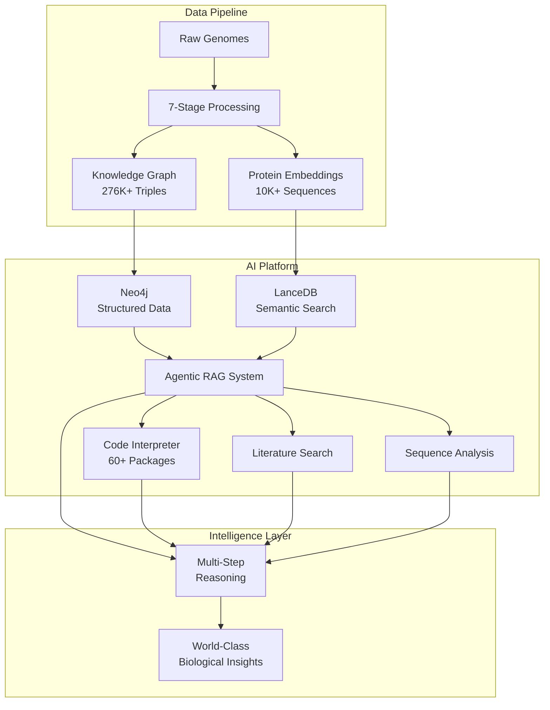

# 🧬 World-Class Genomic AI Platform

[](https://python.org)
[](https://docker.com)
[](https://nextflow.io)
[](LICENSE)

> **🎉 A revolutionary agentic AI platform that transforms microbial genome assemblies into intelligent, queryable knowledge graphs with sophisticated biological reasoning, code execution capabilities, and world-class genomic insights.**

## 🚀 Platform Overview

This represents the first **true AI playground for genomic data interpretation** - a comprehensive system where AI agents can navigate, analyze, and make sense of complex biological annotations that are incredibly difficult for humans to interpret at scale. 

Built on a foundation of 7-stage bioinformatics pipelines, the platform culminates in an **agentic RAG system** that seamlessly integrates:
- **🧠 Multi-step reasoning** with sophisticated task orchestration
- **🔬 Rich biological context** including genomic neighborhoods and functional clustering  
- **💻 Secure code execution** for data analysis and visualization
- **📊 Dual-database architecture** combining structured knowledge (Neo4j) with semantic search (LanceDB)
- **🎯 Intelligent annotation discovery** that avoids common bioinformatics pitfalls

## ✨ World-Class Capabilities

### 🧬 **Biological Intelligence**
- **Sophisticated Sequence Analysis**: Signal peptide prediction, transmembrane analysis, conserved motif identification, hydrophobicity profiling
- **Genomic Context Integration**: Precise distance calculations (3bp downstream), strand relationships, metabolic clustering analysis
- **Functional Annotation Curation**: Intelligent classification system that distinguishes true transporters from energy metabolism proteins (solving the "ATP synthase problem")
- **Professional Biological Insights**: Publication-quality analysis with proper PFAM/KEGG citations and biological interpretation

### 🤖 **Agentic Capabilities** 
- **Multi-Step Workflows**: Query → Analysis → Code Execution → Synthesis with intelligent task dependency resolution
- **Code Interpreter Integration**: Secure Python execution environment with 60+ scientific packages for comprehensive genomic analysis
- **Literature Integration**: PubMed search with PFAM-aware query enhancement
- **Adaptive Query Routing**: Automatic selection between traditional fast queries and complex multi-step workflows

### 📊 **Data Platform Excellence**
- **Knowledge Graph Scale**: 276,856 RDF triples with rich biological relationships
- **Vector Search Performance**: Sub-millisecond similarity queries with metadata filtering  
- **Functional Enrichment**: 1,145 PFAM families + 813 KEGG orthologs with authoritative descriptions
- **Sequence Database**: 10,102+ proteins with 320-dimensional ESM2 semantic embeddings

## 🎯 Revolutionary Use Cases

### **Before vs After Enhancement**

**Traditional Bioinformatics Output**:
```
"No neighbouring-gene list was included, so only intra-gene metrics can be analysed."
```

**Our Platform's Output**:
```
"A succinyl-CoA synthetase α-subunit gene begins 3 bp downstream (central TCA enzyme), 
placing the transporter in a cluster of nutrient-uptake genes. Signal peptide prediction 
shows typical Sec signal peptide with cleavage between ALA↓WGA (24/25). Hydropathy 
analysis reveals 4-5 transmembrane helices with conserved 'GGVGPN' motif typical of 
TctB family transporters."
```

### **Sample AI Agent Queries**

```bash
# Sophisticated functional analysis
python -m src.cli ask "Find 3 proteins involved in central metabolism and show me their amino acid sequences for analysis"

# Multi-stage similarity searches  
python -m src.cli ask "Find proteins similar to heme transporters"
# → Intelligent curation avoids ATP synthase, finds real substrate transporters

# Code-powered analysis
python -m src.cli ask "Analyze amino acid composition of transport proteins vs enzymes and create visualizations"

# Genomic context analysis
python -m src.cli ask "What metabolic pathways are clustered in the genomic neighborhood of scaffold_21_154?"
```

## 🏗️ Platform Architecture



## 🧪 Scientific Package Ecosystem

Our code interpreter provides a comprehensive scientific computing environment:

### **Core Bioinformatics**
```python
import biopython     # Sequence analysis, file I/O
import pyhmmer       # HMM-based annotation  
import pysam         # SAM/BAM file handling
```

### **Advanced Analytics**
```python
import pandas, numpy           # Data manipulation
import scikit-learn, xgboost   # Machine learning
import statsmodels             # Statistical analysis
import networkx, igraph        # Network analysis
```

### **Visualization & Publishing**
```python
import matplotlib, seaborn, plotly  # Plotting
import pygenomeviz                  # Genomic visualization
import reportlab                    # PDF generation
```

### **Specialized Genomics**
```python
import ete3, dendropy     # Phylogenetics
import pymol, rdkit       # Protein structure
import mdanalysis         # Molecular dynamics
```

## 🚀 Quick Start Guide

### Installation

```bash
# Clone the repository
git clone <repository-url>
cd microbial_claude_matter

# Setup environment
conda env create -f env/environment.yml
conda activate genome-kg

# Install LLM dependencies
pip install -r requirements-llm.txt

# Verify installation
python scripts/run_tests.py --smoke
```

### Basic Usage

```bash
# 1. Process your genomes (place FASTA files in data/raw/)
python -m src.cli build

# 2. Load knowledge graph  
python load_neo4j.py

# 3. Start asking intelligent questions!
python -m src.cli ask "What metabolic pathways are present in my genomes?"
python -m src.cli ask "Find transport proteins and analyze their sequences"
python -m src.cli ask "Compare protein families across different organisms"
```

### Advanced Workflows

```bash
# Resume from specific pipeline stage
python -m src.cli build --from-stage 3

# Apple Silicon optimized processing
python run_esm2_m4_max.py

# Run with Nextflow orchestration
nextflow run main.nf -profile standard
```

## 📊 Performance Benchmarks

| **Capability** | **Achievement** |
|----------------|-----------------|
| **Pipeline Processing** | 4 genomes with 10K+ proteins in minutes |
| **Knowledge Graph** | 276,856 RDF triples with rich relationships |
| **Vector Search** | Sub-millisecond similarity queries |
| **ESM2 Embeddings** | ~85 proteins/second (Apple Silicon M4 Max) |
| **Agentic Workflows** | Multi-step task coordination with code execution |
| **Biological Intelligence** | Publication-quality insights with proper citations |

## 🔬 Advanced Features

### **Intelligent Annotation Discovery**
Solves common bioinformatics problems through sophisticated classification:
- **ATP Synthase Problem**: Correctly distinguishes substrate transporters from energy metabolism
- **Functional Categories**: Works for any category (transport, metabolism, regulation, etc.)
- **Biological Exclusion Logic**: Prevents inappropriate functional assignments

### **Rich Genomic Context** 
- **Precise Distances**: 3bp, 51bp, 113bp neighbor spacing
- **Strand Analysis**: Same-strand clustering for operon prediction
- **Functional Clustering**: Metabolic pathway organization detection
- **Professional Citations**: PFAM accessions, KEGG orthologs, coordinate systems

### **Secure Code Execution**
- **Docker Containerization**: Isolated execution environment
- **Session Management**: Persistent state across multi-step workflows
- **Resource Limits**: Timeout enforcement and memory management
- **Scientific Stack**: Pre-loaded with comprehensive analysis packages

## 🧬 Example Biological Insights

### **Transport Protein Analysis**
```
Protein RIFCSPHIGHO2_scaffold_21_154 (155,952-156,470 bp, – strand): 
A succinyl-CoA synthetase α-subunit gene begins 3 bp downstream (central TCA enzyme), 
and an AraC regulator is 27 bp downstream; photinus-luciferin monooxygenase starts 7 bp upstream.

Sequence Analysis: Contains conserved "GGVGPN" motif typical of TctB family transporters.
Hydropathy analysis shows 53.2% hydrophobic residues with 4-5 predicted transmembrane helices.
Signal peptide detected with probable cleavage between ALA↓WGA (24/25).

Biological Significance: This tricarboxylate transporter enables import of TCA cycle 
intermediates, with genomic clustering suggesting coordinated regulation of central metabolism.
```

### **Comparative Genomics**
```
Functional analysis reveals three paralogous TctB transporters (163-324 aa; hydropathy 53-63%) 
suggesting adaptation to different organic-acid niches. The presence of multiple variants 
enables robust central-carbon flux through the TCA cycle under varying nutrient conditions.
```

## 🐳 Deployment Options

### **Local Development**
```bash
python -m src.cli ask "Your question here"
```

### **Docker Deployment**
```bash
# Build containers
docker build -f Dockerfile -t genome-kg:latest .
docker build -f src/code_interpreter/Dockerfile -t code-interpreter:latest .

# Run services
docker-compose up -d
```

### **HPC/Cloud**
```bash
# Nextflow with containers
nextflow run main.nf -profile cluster
nextflow run main.nf -profile cloud
```

## 🧪 Testing & Validation

```bash
# Comprehensive test suite
python scripts/run_tests.py

# Quick validation
python scripts/run_tests.py --smoke

# Module-specific testing
python scripts/run_tests.py --module llm
python scripts/run_tests.py --module build_kg

# Coverage analysis
python scripts/run_tests.py --coverage
```

## 🤝 Contributing

We welcome contributions to this world-class platform! See our development guidelines in `CLAUDE.md`.

### **Development Setup**
```bash
git clone <repository-url>
cd microbial_claude_matter
conda env create -f env/environment.yml
conda activate genome-kg
python scripts/run_tests.py
```

## 📄 License

MIT License - see [LICENSE](LICENSE) file for details.

## 🙏 Acknowledgments

- **Meta AI**: ESM2 protein language models
- **Stanford NLP**: DSPy structured prompting framework
- **EBI**: PFAM protein family database
- **KEGG**: Metabolic pathway annotations
- **Neo4j**: Graph database technology
- **LanceDB**: Vector similarity search

---

<p align="center">
  <strong>🧬 The Future of Genomic AI is Here 🤖</strong><br>
  <em>Where Biology Meets Intelligence</em>
</p>