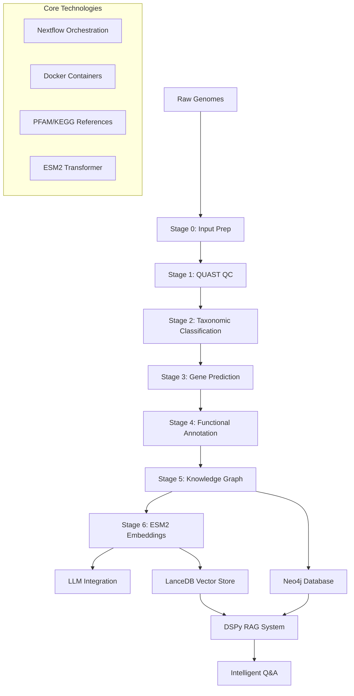

# 🧬 Genomic Knowledge Graph & LLM Platform

[](https://python.org)
[](https://nextflow.io)
[](https://docker.com)
[](LICENSE)

> **A next-generation bioinformatics platform that transforms microbial genome assemblies into intelligent, queryable knowledge graphs with LLM-powered biological insights.**

## 🚀 Overview

This platform represents a paradigm shift in computational genomics, combining traditional bioinformatics workflows with cutting-edge AI/ML technologies. It processes raw microbial genomes through a comprehensive 7-stage pipeline, ultimately creating an intelligent system capable of answering complex biological questions with authoritative, context-aware responses.

### ✨ Key Capabilities

- **🔬 Comprehensive Genome Analysis**: Quality assessment, taxonomic classification, gene prediction, and functional annotation
- **🧠 Intelligent Question Answering**: LLM-powered system with biological expertise for complex genomic queries
- **📊 Knowledge Graph Integration**: 276K+ RDF triples linking genomes, proteins, domains, and functions
- **🔍 Semantic Protein Search**: 320-dimensional ESM2 embeddings with sub-millisecond similarity queries
- **🏗️ Production Architecture**: Containerized microservices with Nextflow orchestration
- **⚡ High Performance**: Apple Silicon optimized with MPS acceleration

## 📈 Performance Highlights

| Metric | Achievement |
|--------|-------------|
| **Pipeline Throughput** | 4 genomes + 10K proteins processed in minutes |
| **Knowledge Graph Scale** | 276,856 RDF triples, 44K+ nodes, 45K+ relationships |
| **ESM2 Processing** | ~85 proteins/second (2 min vs 21 min estimated) |
| **Vector Search** | Sub-millisecond queries with rich metadata filtering |
| **Functional Enrichment** | 1,145 PFAM + 813 KEGG authoritative annotations |
| **Test Coverage** | Zero-maintenance discovery across all modules |

## 🏗️ Architecture



### 🔧 Technology Stack

**Bioinformatics Core**
- **Gene Prediction**: Prodigal
- **Quality Assessment**: QUAST  
- **Functional Annotation**: Astra/PyHMMer (PFAM, KOFAM)
- **Taxonomic Classification**: DFAST_QC

**AI/ML Infrastructure**
- **Language Models**: OpenAI GPT-4o-mini, Anthropic Claude
- **Protein Embeddings**: ESM2 (320-dim)
- **Vector Database**: LanceDB
- **Graph Database**: Neo4j
- **RAG Framework**: DSPy

**Data Processing**
- **Workflow Orchestration**: Nextflow
- **Containerization**: Docker + Singularity
- **Knowledge Representation**: RDF/Turtle
- **Testing**: Pytest with auto-discovery

## 📊 Pipeline Stages

| Stage | Component | Input | Output | Function |
|-------|-----------|-------|--------|----------|
| **0** | Input Preparation | Raw FASTA | Validated genomes | Quality control and organization |
| **1** | QUAST | Assemblies | Quality metrics | Assembly statistics and validation |
| **2** | DFAST_QC | Assemblies | Taxonomic assignment | ANI-based classification |
| **3** | Prodigal | Assemblies | Protein sequences | Gene prediction and translation |
| **4** | Astra Scan | Proteins | Domain/function hits | PFAM/KOFAM annotation |
| **5** | Knowledge Graph | All annotations | RDF triples | Semantic data integration |
| **6** | ESM2 Embeddings | Proteins | Vector embeddings | Semantic similarity search |
| **7** | LLM Integration | All data | Q&A system | Intelligent biological insights |

## 🚀 Quick Start

### Prerequisites

- Python 3.11+
- Conda/Mamba
- Docker (optional)
- Nextflow 23.0+ (optional)

### Installation

```bash
# Clone repository
git clone https://github.com/your-org/microbial-claude-matter.git
cd microbial-claude-matter

# Setup conda environment
conda env create -f env/environment.yml
conda activate genome-kg

# Install additional LLM dependencies
pip install -r requirements-llm.txt

# Verify installation
python run_tests.py --smoke
```

### Basic Usage

```bash
# 1. Process genomes through complete pipeline
python -m src.cli build

# 2. Load knowledge graph into Neo4j
python load_neo4j.py

# 3. Ask biological questions
python -m src.cli ask "What metabolic pathways are present in genome X?"
python -m src.cli ask "Find proteins similar to heme transporters"
python -m src.cli ask "What domains are common in alkaliphilic bacteria?"
```

### Advanced Configuration

```bash
# Resume from specific stage
python -m src.cli build --from-stage 3

# Skip taxonomic classification
python -m src.cli build --skip-tax

# Apple Silicon optimized ESM2
python run_esm2_m4_max.py

# Run with Nextflow
nextflow run main.nf -profile standard
```

## 🧬 Example Biological Insights

### Before vs After Functional Enrichment

**Generic Response (Before)**:
> "This protein is likely involved in a metabolic pathway and may have evolutionary significance across various organisms."

**Enriched Response (After)**:
> "Protein PLM0_60_b1_sep16_scaffold_10001_curated_6 is identified as a **putative heme transporter** (KEGG K20469), which plays a vital role in heme transport and metabolism. Heme is critical for oxygen transport in hemoglobin and electron transfer in cytochromes. The protein's genomic context suggests involvement in aerobic respiration pathways, with functionally similar proteins found across Burkholderiales and Acidobacteria lineages."

### Sample Questions & Capabilities

```bash
# Functional annotation queries
"What is the function of KEGG ortholog K20469?"
"Which proteins contain GGDEF domains?"
"Find all proteins involved in heme transport"

# Comparative genomics
"What metabolic differences exist between these genomes?"
"Which protein families are unique to alkaliphilic bacteria?"
"Find horizontally transferred genes"

# Structural analysis
"What proteins are similar to this amino acid sequence?"
"Find proteins with similar domain architectures"
"Identify potential protein-protein interactions"
```

## 🔬 Advanced Features

### Semantic Protein Search

```python
# Find proteins similar to a heme transporter
import lancedb

db = lancedb.connect("data/stage06_esm2/lancedb")
table = db.open_table("protein_embeddings")

# Query by embedding similarity
results = table.search(query_vector).limit(10).to_pandas()
```

### Knowledge Graph Queries

```cypher
// Find all proteins with heme transport function
MATCH (p:Protein)-[:hasFunction]->(ko:KEGGOrtholog {id: "K20469"})
RETURN p.id, ko.description

// Discover protein families in specific genomes
MATCH (g:Genome {id: "target_genome"})<-[:belongsToGenome]-(gene:Gene)
      <-[:encodedBy]-(p:Protein)-[:hasDomain]->(d:ProteinDomain)
      -[:domainFamily]->(pf:ProteinFamily)
RETURN pf.id, pf.description, count(p) as protein_count
```

### Custom LLM Integration

```python
from src.llm.rag_system import GenomicRAG
from src.llm.config import LLMConfig

# Initialize with custom model
config = LLMConfig(
    llm_provider="anthropic",
    llm_model="claude-3-haiku-20240307"
)

rag = GenomicRAG(config)
response = await rag.ask("Your biological question here")
```

## 🐳 Docker Deployment

### Microservice Architecture

```bash
# Build all containers
docker build -f Dockerfile -t genome-kg:latest .
docker build -f docker/llm.Dockerfile -t genome-kg-llm:latest .

# Run with docker-compose
docker-compose up -d neo4j lancedb llm-api

# Nextflow with containers
nextflow run main.nf -profile docker
```

## 🧪 Testing & Validation

### Comprehensive Test Suite

```bash
# Run all tests
python run_tests.py

# Quick smoke tests during development  
python run_tests.py --smoke

# Test specific modules
python run_tests.py --module build_kg
python run_tests.py --marker integration

# Coverage analysis
python run_tests.py --coverage
```

### Performance Benchmarking

```bash
# ESM2 embedding performance
python test_esm2_similarity.py data/stage06_esm2

# Neo4j query performance  
python test_neo4j.py

# End-to-end LLM integration
python test_llm_integration.py
```

## 🤝 Contributing

We welcome contributions! Please see our [Contributing Guide](CONTRIBUTING.md) for details on:

- Development setup
- Code style guidelines
- Testing requirements
- Pull request process

### Development Workflow

```bash
# Setup development environment
git clone https://github.com/your-org/microbial-claude-matter.git
cd microbial-claude-matter
conda env create -f env/environment.yml
conda activate genome-kg

# Run tests before making changes
python run_tests.py

# Make your changes and test
python run_tests.py --module your_module

# Submit pull request
```

## 📄 License

This project is licensed under the MIT License - see the [LICENSE](LICENSE) file for details.

## 🙏 Acknowledgments

- **PFAM Database**: Protein family annotations from EBI
- **KEGG Database**: Metabolic pathway and ortholog information
- **ESM2 Model**: Meta AI's evolutionary scale modeling
- **DSPy Framework**: Stanford NLP's structured prompting system
- **Nextflow**: Workflow orchestration platform
- **Neo4j**: Graph database technology

## 📧 Contact

- **Project Lead**: [Your Name](mailto:your.email@domain.com)
- **Issues**: [GitHub Issues](https://github.com/your-org/microbial-claude-matter/issues)
- **Discussions**: [GitHub Discussions](https://github.com/your-org/microbial-claude-matter/discussions)

---

<p align="center">
  <strong>🧬 Transforming Genomics with AI-Powered Intelligence 🤖</strong>
</p>
