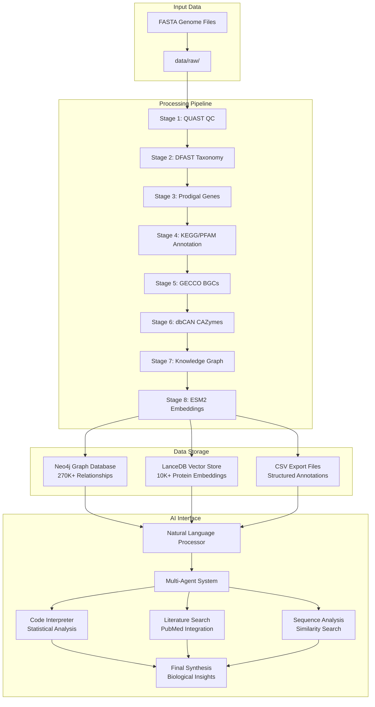
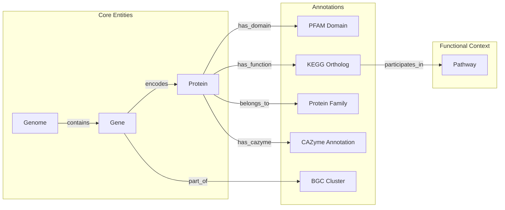

# Bennu: Microbial Genome Analysis Platform

[](https://python.org)
[](https://docker.com)
[](https://neo4j.com)
[](LICENSE)

Bennu is a comprehensive bioinformatics platform that transforms microbial genome assemblies into intelligent, queryable knowledge graphs. The system combines traditional genomic annotation tools with modern AI capabilities to enable natural language exploration of complex biological data.

## System Architecture


```mermaid
graph TB
    subgraph "Input Data"
        A[FASTA Genome Files] --> B[data/raw/]
    end
    
    subgraph "Processing Pipeline"
        B --> C[Stage 1: QUAST QC]
        C --> D[Stage 2: DFAST Taxonomy]
        D --> E[Stage 3: Prodigal Genes]
        E --> F[Stage 4: KEGG/PFAM Annotation]
        F --> G[Stage 5: GECCO BGCs]
        G --> H[Stage 6: dbCAN CAZymes]
        H --> I[Stage 7: Knowledge Graph]
        I --> J[Stage 8: ESM2 Embeddings]
    end
    
    subgraph "Data Storage"
        J --> K[Neo4j Graph Database<br/>270K+ Relationships]
        J --> L[LanceDB Vector Store<br/>10K+ Protein Embeddings]
        J --> M[CSV Export Files<br/>Structured Annotations]
    end
    
    subgraph "AI Interface"
        K --> N[Natural Language Processor]
        L --> N
        M --> N
        N --> O[Multi-Agent System]
        O --> P[Code Interpreter<br/>Statistical Analysis]
        O --> Q[Literature Search<br/>PubMed Integration]
        O --> R[Sequence Analysis<br/>Similarity Search]
        P --> S[Final Synthesis<br/>Biological Insights]
        Q --> S
        R --> S
    end
```

## Core Capabilities

### Comprehensive Genomic Analysis
- **Quality Assessment**: Genome completeness, contamination, and assembly statistics
- **Taxonomic Classification**: Organism identification and phylogenetic placement
- **Gene Prediction**: Open reading frame detection with Prodigal
- **Functional Annotation**: KEGG pathways, PFAM domains, enzyme classifications
- **Secondary Metabolite Detection**: Biosynthetic gene cluster identification
- **Carbohydrate Enzyme Analysis**: CAZyme family classification and substrate prediction
- **Protein Similarity Search**: ESM2-based semantic embeddings for homology detection

### AI-Powered Query Interface
- **Natural Language Processing**: Ask questions in plain English about your genomic data
- **Multi-Step Reasoning**: Complex queries that require multiple analysis steps
- **Code Execution**: Automated statistical analysis and visualization generation
- **Literature Integration**: PubMed search with biological context
- **Comparative Analysis**: Cross-genome comparisons and pattern identification
- **Hypothesis Generation**: AI-driven insights into biological function and evolution

### Advanced Data Integration
- **Knowledge Graph**: Rich biological relationships stored in Neo4j
- **Vector Similarity**: Protein sequence embeddings for functional inference
- **Spatial Analysis**: Genomic neighborhood and operon prediction
- **Pathway Mapping**: Metabolic network reconstruction and analysis
- **Evolutionary Analysis**: Protein family evolution and horizontal gene transfer

## Installation and Setup

### Prerequisites

**Software Requirements:**
- Python 3.11+
- Conda package manager
- Docker and Docker Compose
- Neo4j 5.0+ database
- Git

**Hardware Requirements:**
- 16GB+ RAM (32GB recommended for large datasets)
- 100GB+ available disk space
- SSD storage recommended for database performance

### Step 1: Repository Setup

```bash
# Clone the repository
git clone <repository-url>
cd microbial_claude_matter

# Create and activate conda environment
conda env create -f env/environment.yml
conda activate genome-kg

# Install LLM dependencies
pip install -r requirements-llm.txt
```

### Step 2: Database Setup

**Start Neo4j Database:**
```bash
# Option 1: Using Docker (recommended)
docker run -d \
    --name neo4j-bennu \
    -p 7474:7474 -p 7687:7687 \
    -e NEO4J_AUTH=neo4j/password \
    -v neo4j_data:/data \
    neo4j:5.0

# Option 2: Local Neo4j installation
# Follow Neo4j installation guide for your platform
```

**Configure Database Connection:**
Create `.env` file in project root:
```bash
NEO4J_URI=bolt://localhost:7687
NEO4J_USER=neo4j
NEO4J_PASSWORD=password
```

### Step 3: Code Interpreter Setup

```bash
# Build the code interpreter container
cd src/code_interpreter
docker build -t bennu-code-interpreter .

# Start the service
docker run -d \
    --name bennu-interpreter \
    -p 8000:8000 \
    bennu-code-interpreter

# Return to project root
cd ../..
```

### Step 4: Verify Installation

```bash
# Run system tests
python scripts/run_tests.py --smoke

# Test database connectivity
python -c "from src.llm.query_processor import QueryProcessor; qp = QueryProcessor(); print('Database connected!')"

# Test code interpreter
python -c "import requests; print('Code interpreter:', requests.get('http://localhost:8000/health').status_code == 200)"
```

## Getting Started

### Processing Your First Genome

**Step 1: Prepare Input Data**
```bash
# Place your FASTA files in the input directory
mkdir -p data/raw
cp /path/to/your/genome.fasta data/raw/
```

**Step 2: Run the Processing Pipeline**
```bash
# Process all genomes (takes 10-30 minutes depending on size)
python -m src.cli build

# Optional: Resume from specific stage if interrupted
python -m src.cli build --from-stage 4
```

**Step 3: Load Data into Neo4j**
```bash
# Use the bulk loader for optimal performance
python -m src.build_kg.neo4j_bulk_loader --csv-dir data/stage07_kg/csv
```

**Step 4: Start Querying**
```bash
# Basic information queries
python -m src.cli ask "How many genomes were processed?"
python -m src.cli ask "What organisms are in my dataset?"

# Functional analysis
python -m src.cli ask "What metabolic pathways are present?"
python -m src.cli ask "Find all transport proteins"

# Comparative analysis
python -m src.cli ask "Compare CAZyme distributions across genomes"
python -m src.cli ask "Which genome has the most biosynthetic gene clusters?"
```

## Advanced Usage

### Complex Biological Queries

**Genomic Context Analysis:**
```bash
python -m src.cli ask "Analyze the genomic neighborhood of gene XYZ"
python -m src.cli ask "Find operons containing hypothetical proteins"
python -m src.cli ask "Identify potential prophage regions"
```

**Protein Function Prediction:**
```bash
python -m src.cli ask "Find proteins similar to heme transporters"
python -m src.cli ask "Classify proteins with unknown function in genome ABC"
python -m src.cli ask "Predict enzyme activities for protein sequences"
```

**Metabolic Network Analysis:**
```bash
python -m src.cli ask "Reconstruct central carbon metabolism pathways"
python -m src.cli ask "Find incomplete metabolic pathways"
python -m src.cli ask "Identify potential metabolic dependencies"
```

**Comparative Genomics:**
```bash
python -m src.cli ask "Compare secondary metabolite potential across genomes"
python -m src.cli ask "Find genome-specific protein families"
python -m src.cli ask "Analyze horizontal gene transfer events"
```

### Data Export and Integration

**Export Structured Data:**
```bash
# Export annotations to CSV
python -m src.export.annotations --format csv --output annotations.csv

# Export knowledge graph
python -m src.export.graph --format graphml --output network.graphml

# Export protein sequences with annotations
python -m src.export.sequences --format fasta --annotated --output proteins.fasta
```

**API Access:**
```python
from src.llm.rag_system.core import GenomicRAG

# Initialize system
rag = GenomicRAG()

# Programmatic queries
result = rag.query("Find all ABC transporters")
proteins = rag.get_proteins_by_function("transporter")
pathways = rag.get_pathways_by_genome("genome_id")
```

## Data Products

### Knowledge Graph Schema

The Neo4j database contains comprehensive biological relationships:


```mermaid
graph LR
    A[Genome] -->|contains| B[Gene]
    B -->|encodes| C[Protein]
    C -->|has_domain| D[PFAM Domain]
    C -->|has_function| E[KEGG Ortholog]
    C -->|belongs_to| F[Protein Family]
    E -->|participates_in| G[Pathway]
    C -->|has_cazyme| H[CAZyme Annotation]
    B -->|part_of| I[BGC Cluster]
    
    subgraph "Annotations"
        D
        E
        F
        H
        I
    end
    
    subgraph "Core Entities"
        A
        B
        C
    end
    
    subgraph "Functional Context"
        G
    end
```

### File Organization

```
data/
├── raw/                          # Input FASTA files
├── stage01_quast/               # Quality assessment reports
├── stage02_dfast/               # Taxonomic classification
├── stage03_prodigal/            # Gene predictions (GFF, proteins)
├── stage04_astra/               # KEGG/PFAM annotations
├── stage05_gecco/               # Biosynthetic gene clusters
├── stage06_dbcan/               # CAZyme annotations
├── stage07_kg/                  # Knowledge graph (RDF, CSV)
│   ├── csv/                     # Bulk loader input files
│   ├── rdf/                     # RDF turtle files
│   └── exports/                 # Structured data exports
└── stage08_esm2/                # Protein embeddings
    ├── embeddings/              # ESM2 vectors
    └── lancedb/                 # Vector database
```

## Performance and Scaling

### Benchmark Results

| Dataset Size | Processing Time | Memory Usage | Query Response |
|--------------|----------------|--------------|----------------|
| 1 genome (3K genes) | 5 minutes | 8GB | <1 second |
| 4 genomes (12K genes) | 15 minutes | 16GB | <2 seconds |
| 10 genomes (30K genes) | 45 minutes | 32GB | <5 seconds |

### Optimization Options

**Apple Silicon Acceleration:**
```bash
# Use optimized ESM2 processing
python run_esm2_m4_max.py
```

**Distributed Processing:**
```bash
# Use Nextflow for HPC environments
nextflow run main.nf -profile cluster
```

**Memory Management:**
```bash
# Adjust batch sizes for large datasets
export BATCH_SIZE=100
export MAX_WORKERS=4
```

## Configuration

### Environment Variables

```bash
# Database connections
NEO4J_URI=bolt://localhost:7687
NEO4J_USER=neo4j
NEO4J_PASSWORD=password

# LLM API keys
OPENAI_API_KEY=your_openai_key
ANTHROPIC_API_KEY=your_anthropic_key

# Processing options
BATCH_SIZE=200
MAX_WORKERS=8
ENABLE_GPU=true
```

### Analysis Parameters

Key configuration files:
- `env/environment.yml` - Conda dependencies
- `requirements-llm.txt` - LLM-specific packages
- `src/config/` - Analysis thresholds and parameters
- `.env` - Runtime environment settings

## Troubleshooting

### Common Issues

**Database Connection:**
```bash
# Check Neo4j status
docker logs neo4j-bennu

# Test connection
python -c "from neo4j import GraphDatabase; driver = GraphDatabase.driver('bolt://localhost:7687', auth=('neo4j', 'password')); print('Connected:', driver.verify_connectivity())"
```

**Memory Issues:**
```bash
# Reduce batch sizes
export BATCH_SIZE=50

# Monitor memory usage
htop  # or Activity Monitor on macOS
```

**Pipeline Failures:**
```bash
# Check logs
tail -f logs/pipeline.log

# Resume from last successful stage
python -m src.cli build --from-stage N
```

## Testing and Validation

### Test Suite

```bash
# Full test suite
python scripts/run_tests.py

# Quick smoke tests
python scripts/run_tests.py --smoke

# Module-specific tests
python scripts/run_tests.py --module llm
python scripts/run_tests.py --module build_kg

# Coverage analysis
python scripts/run_tests.py --coverage
```

### Validation Checks

```bash
# Validate pipeline outputs
python scripts/validate_pipeline.py

# Check data quality
python scripts/check_annotations.py

# Benchmark performance
python scripts/benchmark.py
```

## Contributing

### Development Setup

```bash
# Install development dependencies
pip install -r requirements-dev.txt

# Pre-commit hooks
pre-commit install

# Run linting
black src/
flake8 src/
mypy src/
```

### Architecture Overview

**Core Modules:**
- `src/ingest/` - Data processing pipeline
- `src/build_kg/` - Knowledge graph construction
- `src/llm/` - AI query interface and reasoning
- `src/export/` - Data export utilities
- `src/tests/` - Test suite and validation

**Key Design Patterns:**
- Modular pipeline stages for maintainability
- Graph-based data model for biological relationships
- Agent-based AI system for complex reasoning
- Vector embeddings for semantic similarity

## License

MIT License - see [LICENSE](LICENSE) file for details.

## Citation

If you use Bennu in your research, please cite:

```bibtex
@software{bennu_genomics,
  title={Bennu: AI-Powered Microbial Genome Analysis Platform},
  author={[Authors]},
  year={2025},
  url={https://github.com/[repo]}
}
```

## Dependencies

### Bioinformatics Tools
- **QUAST** - Genome quality assessment
- **DFAST** - Taxonomic classification  
- **Prodigal** - Gene prediction
- **KEGG** - Functional annotation
- **PFAM** - Protein domain classification
- **GECCO** - Biosynthetic gene cluster detection
- **dbCAN** - Carbohydrate enzyme annotation

### AI/ML Frameworks
- **ESM2** - Protein language models (Meta AI)
- **DSPy** - Structured LLM prompting (Stanford)
- **LangChain** - Agent orchestration
- **OpenAI/Anthropic APIs** - Large language models

### Data Infrastructure
- **Neo4j** - Graph database
- **LanceDB** - Vector similarity search
- **pandas/numpy** - Data processing
- **Docker** - Containerization
- **Nextflow** - Workflow orchestration