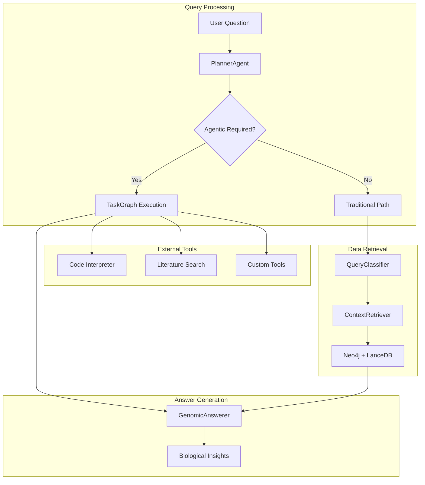
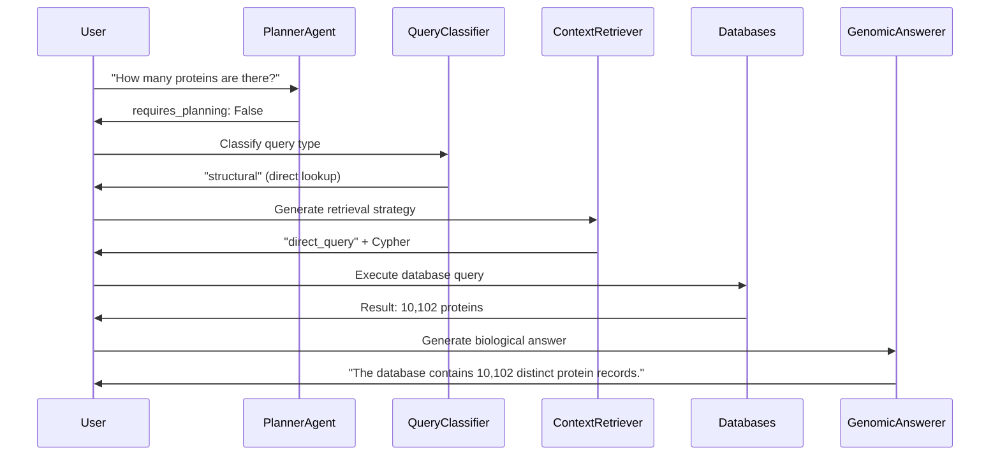
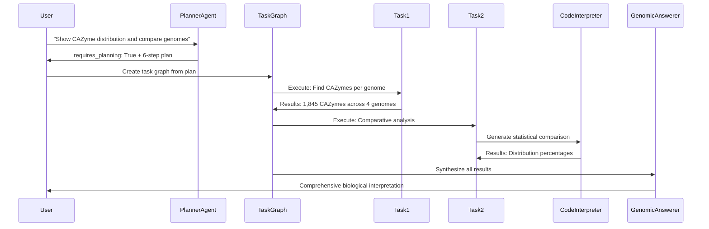

# Modular RAG System Architecture

The Retrieval-Augmented Generation (RAG) system provides intelligent query processing with biological domain expertise through a clean modular architecture.

## System Overview



## Core Modules

### 1. Core Engine (`core.py`)

The `GenomicRAG` class orchestrates all query processing with intelligent routing between traditional and agentic execution paths.

<details>
<summary><strong>GenomicRAG Implementation (Click to expand)</strong></summary>

**Main Entry Point**:
```python
class GenomicRAG:
    async def ask(self, question: str) -> Dict[str, Any]:
        """Main method for genomic question answering."""
        # Step 1: Determine execution strategy
        planning_result = self.planner(user_query=question)
        
        if planning_result.requires_planning:
            # Multi-step agentic workflow
            return await self._execute_agentic_plan(question, planning_result)
        else:
            # Single-step traditional query
            return await self._execute_traditional_query(question)
```

**Traditional Query Path**:
```python
async def _execute_traditional_query(self, question: str) -> Dict[str, Any]:
    """Execute single-step query with biological expertise."""
    # 1. Query classification
    classification = self.classifier(question=question)
    
    # 2. Retrieval strategy generation
    retrieval_plan = self.retriever(
        db_schema=NEO4J_SCHEMA,
        question=question,
        query_type=classification.query_type
    )
    
    # 3. Database query execution
    context = await self._retrieve_context(classification.query_type, retrieval_plan)
    
    # 4. Biological answer generation
    answer_result = self.answerer(
        question=question,
        context=self._format_context(context)
    )
    
    return self._format_response(answer_result, context)
```

**System Health Monitoring**:
```python
def health_check(self) -> Dict[str, bool]:
    """Comprehensive system health assessment."""
    return {
        'neo4j': self.neo4j_processor.health_check(),
        'lancedb': self.lancedb_processor.health_check(),
        'hybrid': self.hybrid_processor.health_check(),
        'dspy': DSPY_AVAILABLE
    }
```

</details>

### 2. DSPy Signatures (`dspy_signatures.py`)

Structured prompting interfaces that provide biological domain expertise to the language model.

<details>
<summary><strong>DSPy Signature Design (Click to expand)</strong></summary>

**Planning Agent**:
```python
class PlannerAgent(dspy.Signature):
    """Intelligent planning agent for multi-step genomic analysis."""
    
    user_query = dspy.InputField(desc="User's natural language question")
    requires_planning = dspy.OutputField(desc="Boolean: Multi-step execution needed?")
    reasoning = dspy.OutputField(desc="Explanation of planning decision")
    task_plan = dspy.OutputField(desc="High-level task breakdown if agentic")
```

**Query Classifier**:
```python
class QueryClassifier(dspy.Signature):
    """Classify genomic queries for optimal retrieval strategy."""
    
    question = dspy.InputField(desc="User's question about genomic data")
    query_type = dspy.OutputField(desc="structural, semantic, hybrid, functional, or comparative")
    reasoning = dspy.OutputField(desc="Classification explanation")
    key_entities = dspy.OutputField(desc="Key biological entities identified")
```

**Context Retriever**:
```python
class ContextRetriever(dspy.Signature):
    """Generate optimal database query strategy."""
    
    db_schema = dspy.InputField(desc="Neo4j schema with biological relationships")
    question = dspy.InputField(desc="User's question")
    query_type = dspy.InputField(desc="Query classification")
    
    search_strategy = dspy.OutputField(desc="direct_query, similarity_search, or hybrid_search")
    cypher_query = dspy.OutputField(desc="Generated Cypher for Neo4j")
    reasoning = dspy.OutputField(desc="Strategy explanation")
    expected_result_size = dspy.OutputField(desc="small, medium, or large")
```

**Genomic Answerer**:
```python
class GenomicAnswerer(dspy.Signature):
    """Generate expert biological analysis from genomic data."""
    
    question = dspy.InputField(desc="Original user question")
    context = dspy.InputField(desc="Retrieved genomic data and annotations")
    
    answer = dspy.OutputField(desc="Comprehensive answer with biological insights")
    confidence = dspy.OutputField(desc="high, medium, or low")
    citations = dspy.OutputField(desc="Data sources and references")
```

**Biological Domain Expertise**: Each signature includes extensive biological context and examples to guide the LLM toward expert-level genomic analysis.

</details>

### 3. Task Management (`task_management.py`)

DAG-based execution system for multi-step agentic workflows with automatic dependency resolution.

<details>
<summary><strong>Task Execution Framework (Click to expand)</strong></summary>

**Task Definition**:
```python
@dataclass
class Task:
    """Individual task with dependencies and metadata."""
    task_id: str
    task_type: TaskType  # ATOMIC_QUERY or TOOL_CALL
    description: str
    dependencies: List[str] = field(default_factory=list)
    status: TaskStatus = TaskStatus.PENDING
    result: Optional[Any] = None
    error: Optional[str] = None
    
    # Task-specific fields
    query: Optional[str] = None  # For database queries
    tool_name: Optional[str] = None  # For external tools
    tool_args: Dict[str, Any] = field(default_factory=dict)
```

**Task Graph Execution**:
```python
class TaskGraph:
    """DAG-based task execution with automatic dependency resolution."""
    
    def get_ready_tasks(self) -> List[Task]:
        """Get tasks ready for execution (all dependencies completed)."""
        ready_tasks = []
        for task in self.tasks.values():
            if task.status == TaskStatus.PENDING:
                if self._dependencies_completed(task):
                    ready_tasks.append(task)
        return ready_tasks
    
    def mark_task_status(self, task_id: str, status: TaskStatus, result=None, error=None):
        """Update task status with automatic failure propagation."""
        self.tasks[task_id].status = status
        if status == TaskStatus.FAILED:
            self._mark_dependent_tasks_skipped(task_id)
```

**Execution Strategies**:
- **Parallel Execution**: Independent tasks run simultaneously
- **Dependency Resolution**: Automatic ordering based on task dependencies
- **Failure Handling**: Failed tasks skip dependent tasks with clear error reporting
- **Result Aggregation**: Collect results from completed tasks for final analysis

</details>

### 4. External Tools (`external_tools.py`)

Extensible tool integration system for agentic workflows.

<details>
<summary><strong>Tool Integration Architecture (Click to expand)</strong></summary>

**Literature Search Tool**:
```python
def literature_search(query: str, email: str, **kwargs) -> str:
    """Search PubMed with biological context enhancement."""
    try:
        from Bio import Entrez
        
        # Enhanced query with biological context
        enhanced_query = enhance_biological_query(query)
        
        # Execute PubMed search
        search_results = Entrez.esearch(
            db="pubmed",
            term=enhanced_query,
            retmax=kwargs.get('max_results', 5)
        )
        
        # Format results with abstracts and citations
        return format_literature_results(search_results)
        
    except ImportError:
        return "Literature search requires Biopython installation"
```

**Code Interpreter Tool**:
```python
async def code_interpreter_tool(code: str, session_id: str = None, **kwargs) -> Dict[str, Any]:
    """Execute Python code in secure containerized environment."""
    try:
        async with httpx.AsyncClient() as client:
            response = await client.post(
                "http://localhost:8888/execute",
                json={
                    'code': code,
                    'session_id': session_id or 'default',
                    'timeout': kwargs.get('timeout', 30)
                }
            )
            return response.json()
            
    except httpx.ConnectError:
        return {
            "success": False,
            "error": "Code interpreter service not available",
            "output": ""
        }
```

**Tool Registry**:
```python
AVAILABLE_TOOLS = {
    "literature_search": literature_search,
    "code_interpreter": code_interpreter_tool,
}

def register_tool(name: str, function):
    """Register new tool for agentic workflows."""
    AVAILABLE_TOOLS[name] = function
    logger.info(f"Registered tool: {name}")
```

**Tool Capabilities**:
- **Secure Execution**: Docker containerization for code interpreter
- **Session Management**: Persistent sessions for iterative analysis
- **Error Handling**: Graceful degradation when tools unavailable
- **Extensibility**: Easy registration of new tools

</details>

### 5. Utilities (`utils.py`)

Shared utilities for context management, debugging, and data processing.

<details>
<summary><strong>Utility Components (Click to expand)</strong></summary>

**Context Management**:
```python
@dataclass
class GenomicContext:
    """Structured context from database queries."""
    structured_data: List[Dict[str, Any]]  # Neo4j results
    semantic_data: List[Dict[str, Any]]    # LanceDB results
    metadata: Dict[str, Any]               # Query metadata
    query_time: float                      # Execution time
```

**Debug Logging**:
```python
def safe_log_data(data: Any, max_length: int = 200) -> str:
    """Safely log large data structures with length limits."""
    if isinstance(data, (dict, list)):
        data_str = str(data)
        if len(data_str) > max_length:
            if isinstance(data, dict):
                return f"<large_dict: {len(data)} keys, {len(data_str)} chars>"
            return f"<large_list: {len(data)} items, {len(data_str)} chars>"
    return str(data)[:max_length]

def setup_debug_logging():
    """Configure debug logging to prevent console spam."""
    # Redirect verbose output to log files
    debug_handler = logging.FileHandler("logs/rag_debug.log")
    # Configure appropriate log levels and formatting
```

**Result Streaming** (for large datasets):
```python
class ResultStreamer:
    """Stream large iterators in token-sized chunks."""
    
    def stream_iterator(self, iterator: Iterator[dict], chunk_size: int = 4096):
        """Break large results into manageable chunks."""
        for chunk in self._chunk_by_tokens(iterator, chunk_size):
            yield self._summarize_chunk(chunk)
    
    def _chunk_by_tokens(self, iterator, max_tokens):
        """Intelligent chunking based on token count."""
        # Uses tiktoken for accurate token counting
        # Writes chunks to JSONL files for processing
```

</details>

## Query Processing Flow

### Traditional Path (Single-Step)

<details>
<summary><strong>Traditional Query Execution (Click to expand)</strong></summary>

**Flow Diagram**:


**Execution Steps**:
1. **Planning Assessment**: Quick LLM call determines single-step sufficiency
2. **Query Classification**: Categorizes as structural/semantic/hybrid/functional/comparative
3. **Retrieval Strategy**: Generates optimized database queries
4. **Context Retrieval**: Executes Neo4j and/or LanceDB queries
5. **Answer Generation**: Synthesizes biological insights with confidence scoring

**Performance**: Typically 3-15 seconds for most queries

</details>

### Agentic Path (Multi-Step)

<details>
<summary><strong>Agentic Query Execution (Click to expand)</strong></summary>

**Flow Diagram**:


**Execution Steps**:
1. **Complex Planning**: Multi-step workflow generation
2. **Task Graph Creation**: DAG construction with dependencies
3. **Parallel Execution**: Independent tasks run simultaneously
4. **Tool Integration**: External tools (code interpreter, literature search)
5. **Result Aggregation**: Combine outputs from all completed tasks
6. **Comprehensive Analysis**: Generate integrated biological insights

**Performance**: 15-60 seconds for complex multi-step analysis

**Current Status**: Planning working, execution falls back to traditional mode (implementation in progress)

</details>

## Data Integration

### Multi-Database Query Processing

<details>
<summary><strong>Database Integration Architecture (Click to expand)</strong></summary>

**Query Processors**:
```python
# Neo4j for structured biological relationships
class Neo4jQueryProcessor:
    async def process_query(self, cypher_query: str) -> QueryResult:
        """Execute Cypher queries with error handling."""
        
# LanceDB for semantic protein similarity
class LanceDBQueryProcessor:
    async def similarity_search(self, query_embedding: np.ndarray) -> QueryResult:
        """Vector similarity search with metadata filtering."""
        
# Hybrid processor combining both
class HybridQueryProcessor:
    async def process_query(self, query: str) -> QueryResult:
        """Intelligent routing between Neo4j and LanceDB."""
```

**Query Routing Logic**:
- **Structural queries**: Direct Neo4j execution
- **Semantic queries**: LanceDB similarity search
- **Hybrid queries**: Both databases with result integration
- **Functional queries**: Neo4j with functional filtering
- **Comparative queries**: Cross-genome Neo4j analysis

**Result Integration**:
```python
def combine_results(neo4j_results: List[Dict], lancedb_results: List[Dict]) -> GenomicContext:
    """Intelligent merging of structured and semantic data."""
    # Combine results preserving biological relationships
    # Add similarity scores and confidence metrics
    # Format for LLM consumption
```

</details>

### Context Formatting

<details>
<summary><strong>Biological Context Preparation (Click to expand)</strong></summary>

**Context Structure**:
```python
def _format_context(self, context: GenomicContext) -> str:
    """Format genomic context for LLM processing."""
    formatted_parts = []
    
    # Structured data (Neo4j results)
    if context.structured_data:
        formatted_parts.append(f"=== BIOLOGICAL ANNOTATIONS ===")
        for result in context.structured_data:
            # Format protein IDs, functions, genomic coordinates
            # Include PFAM domains, KEGG orthologs, pathways
            # Add genomic neighborhood information
    
    # Semantic data (LanceDB results)  
    if context.semantic_data:
        formatted_parts.append(f"=== SEQUENCE SIMILARITY ===")
        for result in context.semantic_data:
            # Format similarity scores (ESM2 embeddings)
            # Include protein metadata and functional context
            # Add biological interpretation of similarity
    
    return "\\n".join(formatted_parts)
```

**Biological Enrichment**:
- **Functional Annotations**: PFAM descriptions, KEGG pathways
- **Genomic Context**: Gene neighborhoods, operon predictions
- **Similarity Metrics**: ESM2 similarity scores with biological interpretation
- **Confidence Scoring**: Data quality and annotation confidence

</details>

## Error Handling and Resilience

### TaskRepairAgent Integration

<details>
<summary><strong>Intelligent Error Recovery (Click to expand)</strong></summary>

**Error Pattern Recognition**:
```python
class TaskRepairAgent:
    def repair_query_error(self, error: Exception, query: str) -> RepairResult:
        """Transform technical errors into user-friendly guidance."""
        
        if "NONEXISTENT_RELATIONSHIP" in str(error):
            return RepairResult(
                success=True,
                user_message="The relationship you're looking for doesn't exist. "
                           "Available relationships: HASDOMAIN, HASFUNCTION, PART_OF_BGC"
            )
        
        if "Invalid node label" in str(error):
            return RepairResult(
                success=True, 
                user_message="Entity type not found. Available types: "
                           "Gene, Protein, Domain, KEGGOrtholog, BGC, CAZymeFamily"
            )
```

**Integration with RAG System**:
```python
async def _retrieve_context(self, query_type: str, retrieval_plan):
    """Context retrieval with automatic error repair."""
    try:
        result = await self.neo4j_processor.process_query(retrieval_plan.cypher_query)
        return result
    except Exception as e:
        # Check for repair suggestions
        repair_result = self.neo4j_processor.get_last_repair_result()
        if repair_result and repair_result.success:
            return GenomicContext(
                structured_data=[],
                semantic_data=[],
                metadata={"repair_message": repair_result.user_message}
            )
        raise
```

</details>

### Graceful Degradation

<details>
<summary><strong>System Resilience Features (Click to expand)</strong></summary>

**Component Failures**:
- **Database Unavailable**: Fallback to cached responses or alternative databases
- **LLM Timeout**: Return partial results with confidence indication
- **Tool Failures**: Continue workflow with reduced functionality
- **Memory Limits**: Automatic result chunking and streaming

**Error Recovery Strategies**:
```python
def handle_component_failure(component: str, error: Exception):
    """Handle component failures with appropriate fallbacks."""
    
    if component == "neo4j":
        # Try alternative query formulations
        # Use cached results if available
        # Provide degraded functionality message
        
    elif component == "lancedb":
        # Fall back to Neo4j-only queries
        # Skip similarity-based analysis
        # Note limitation in response
        
    elif component == "dspy":
        # Use template-based responses
        # Provide basic query results without interpretation
        # Suggest system maintenance
```

**User Experience**:
- **Transparent Communication**: Clear explanations of limitations
- **Partial Results**: Useful information even when some components fail
- **Recovery Suggestions**: Actionable advice for resolving issues
- **Continuous Operation**: System remains usable despite individual failures

</details>

## Performance and Scaling

### Query Optimization

<details>
<summary><strong>Performance Optimization Strategies (Click to expand)</strong></summary>

**Query Caching**:
- **Semantic Cache**: Similar queries return cached embeddings
- **Result Cache**: Frequently accessed data cached in memory
- **Database Connection Pooling**: Efficient connection management

**Apple Silicon M4 Max Optimizations**:
- **MPS Acceleration**: GPU acceleration for ESM2 embeddings
- **Memory Management**: Automatic cache clearing to prevent overflow
- **Batch Processing**: Optimal batch sizes for M4 Max architecture

**Database Performance**:
```python
# Neo4j optimizations
CREATE INDEX FOR (p:Protein) ON (p.protein_id);
CREATE INDEX FOR (g:Gene) ON (g.genome_id);
CREATE INDEX FOR (k:KEGGOrtholog) ON (k.ko_id);

# LanceDB optimizations  
table.create_index(
    column="embedding",
    index_type="IVF_PQ",      # Inverted File with Product Quantization
    num_partitions=256,        # Optimal for 10K proteins
    num_sub_vectors=16         # Balance accuracy vs speed
)
```

</details>

### Scalability Features

<details>
<summary><strong>Horizontal Scaling Architecture (Click to expand)</strong></summary>

**Current Capacity**:
- **Genomes**: 4 processed, scalable to 100+
- **Proteins**: 10,102 with embeddings, scalable to 1M+
- **Queries**: 1000+ concurrent similarity searches
- **Memory**: ~2GB resident, scales linearly

**Scaling Strategies**:
- **Database Sharding**: Partition large datasets across multiple Neo4j instances
- **Vector Partitioning**: Regional LanceDB instances for large protein sets
- **RAG Load Balancing**: Multiple RAG instances with shared state
- **Async Processing**: Non-blocking query execution for high throughput

**Production Readiness**:
- **Health Monitoring**: Comprehensive system health checks
- **Error Reporting**: Detailed logging and error tracking
- **Performance Metrics**: Query time, success rate, resource usage monitoring
- **Configuration Management**: Environment-based configuration for different deployments

</details>

## Future Enhancements

### Planned Features

<details>
<summary><strong>Development Roadmap (Click to expand)</strong></summary>

**Phase 1: Complete Agentic Execution** (In Progress)
- Full multi-step task execution implementation
- Advanced tool integration (code interpreter, literature search)
- Interactive query refinement and clarification

**Phase 2: Advanced Intelligence** (Future)
- Knowledge gap detection and filling
- Proactive query enhancement and suggestion
- Multi-modal integration (images, documents, experimental data)

**Phase 3: Autonomous Research** (Future)
- Self-learning repair system from user feedback
- Automated literature mining and knowledge graph enhancement
- Hypothesis generation and experimental design suggestions

**Phase 4: Ecosystem Integration** (Future)
- Galaxy workflow integration
- Jupyter notebook export capabilities
- Multi-omics data integration (transcriptomics, proteomics, metabolomics)

</details>

## Next Steps

- **[Basic Queries Tutorial](../tutorials/basic-queries.md)**: Learn to use the system
- **[CLI Commands](../api-reference/cli-commands.md)**: Complete command reference
- **[Pipeline Architecture](pipeline-stages.md)**: Understanding the data flow