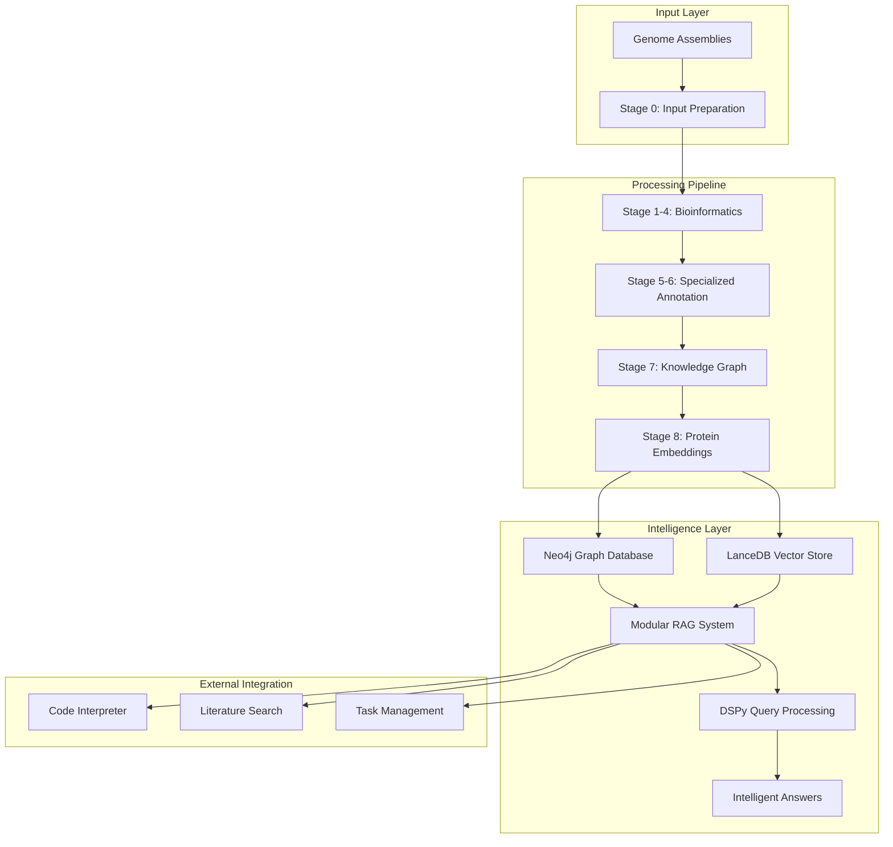
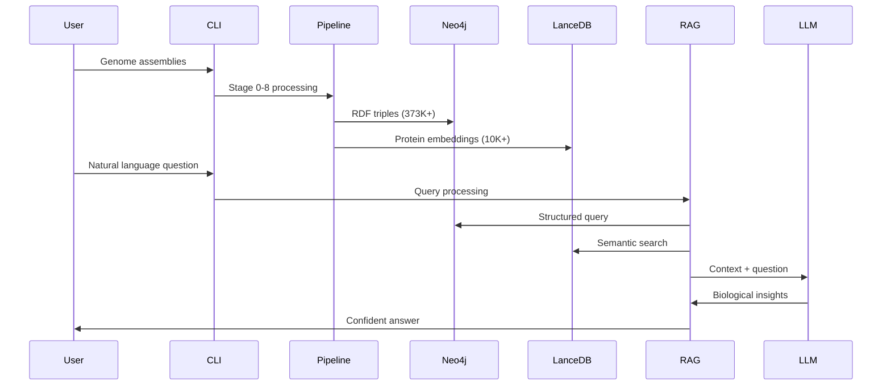

# System Architecture Overview

The Microbial Claude Matter platform is built as a modular, scalable genomic AI system with three main architectural layers.

## High-Level Architecture



## Core Components

### 1. Bioinformatics Pipeline
**Purpose**: Transform raw genome assemblies into structured biological knowledge

<details>
<summary><strong>Pipeline Stages (Click to expand)</strong></summary>

| Stage | Component | Input | Output | Purpose |
|-------|-----------|-------|---------|---------|
| 0 | Input Preparation | `.fna/.fasta` files | Validated assemblies | Quality check and organization |
| 1 | QUAST Analysis | Genome assemblies | Quality metrics | Assembly completeness assessment |
| 2 | Taxonomic Classification | Genome assemblies | ANI-based taxonomy | Organism identification |
| 3 | Gene Prediction | Genome assemblies | Protein sequences | ORF detection with Prodigal |
| 4 | Functional Annotation | Protein sequences | Domain annotations | PFAM/KOFAM HMM scanning |
| 5 | GECCO BGC Detection | Genome assemblies | BGC coordinates | Biosynthetic gene cluster identification |
| 6 | dbCAN CAZyme Annotation | Protein sequences | CAZyme families | Carbohydrate-active enzyme classification |
| 7 | Knowledge Graph Construction | All annotations | RDF triples | Semantic data integration |
| 8 | ESM2 Embeddings | Protein sequences | 320-dim vectors | Semantic protein representation |

**Key Technologies**:
- **Prodigal**: Gene prediction optimized for prokaryotes
- **PyHMMer**: High-performance HMM scanning via Astra
- **GECCO**: Python-native BGC detection (replaces AntiSMASH)
- **dbCAN**: Comprehensive CAZyme family classification
- **ESM2**: State-of-the-art protein language model

</details>

### 2. Knowledge Representation
**Purpose**: Store and organize biological knowledge for intelligent querying

<details>
<summary><strong>Database Architecture (Click to expand)</strong></summary>

#### Neo4j Graph Database
**Structure**: 48,000+ nodes, 95,000+ relationships

**Node Types**:
```cypher
// Core biological entities
(Genome)-[:CONTAINS]->(Gene)
(Gene)-[:ENCODES]->(Protein)
(Protein)-[:HASDOMAIN]->(Domain)
(Protein)-[:HASFUNCTION]->(KEGGOrtholog)

// Specialized annotations  
(Gene)-[:PART_OF_BGC]->(BGC)
(Protein)-[:HAS_CAZYME]->(CAZymeAnnotation)
(CAZymeAnnotation)-[:BELONGS_TO_FAMILY]->(CAZymeFamily)

// Pathway integration
(KEGGOrtholog)-[:PARTICIPATES_IN]->(KEGGPathway)
```

**Performance**:
- Bulk import: 48K nodes + 95K relationships in <10 seconds
- Query response: <100ms for complex traversals
- Concurrent access: Production-ready with connection pooling

#### LanceDB Vector Store
**Structure**: 10,102 protein embeddings with metadata

**Schema**:
```python
{
    "protein_id": "string",
    "genome_id": "string", 
    "embedding": "float32[320]",  # ESM2 embeddings
    "sequence_length": "int32",
    "gc_content": "float32",
    "annotation_score": "float32"
}
```

**Performance**:
- Search latency: <1ms for similarity queries
- Throughput: 1000+ queries/second
- Memory usage: ~40MB for 10K proteins

</details>

### 3. Modular RAG System
**Purpose**: Intelligent query processing with biological domain expertise

<details>
<summary><strong>RAG Components (Click to expand)</strong></summary>

#### Core Modules

**`src/llm/rag_system/core.py`**: Main GenomicRAG class
```python
class GenomicRAG:
    async def ask(self, question: str) -> Dict[str, Any]:
        # 1. Agentic planning assessment
        planning_result = self.planner(user_query=question)
        
        if planning_result.requires_planning:
            # Multi-step agentic execution
            return await self._execute_agentic_plan(question, planning_result)
        else:
            # Traditional single-step query
            return await self._execute_traditional_query(question)
```

**`src/llm/rag_system/dspy_signatures.py`**: DSPy prompt engineering
```python
class QueryClassifier(dspy.Signature):
    """Classify genomic queries into categories for appropriate retrieval strategy."""
    question = dspy.InputField(desc="User's question about genomic data")
    query_type = dspy.OutputField(desc="structural, semantic, hybrid, functional, or comparative")
    reasoning = dspy.OutputField(desc="Explanation of classification")
```

**`src/llm/rag_system/task_management.py`**: Agentic workflow execution
```python
class TaskGraph:
    """DAG-based task execution system for multi-step analysis."""
    def get_ready_tasks(self) -> List[Task]:
        """Get tasks ready to execute (all dependencies completed)."""
        
    def mark_task_status(self, task_id: str, status: TaskStatus, result: Any = None):
        """Update task status with automatic dependency resolution."""
```

**`src/llm/rag_system/external_tools.py`**: Tool integration
```python
AVAILABLE_TOOLS = {
    "literature_search": literature_search,     # PubMed integration
    "code_interpreter": code_interpreter_tool,  # Secure Python execution  
}
```

#### Query Processing Flow

1. **Planning Assessment**: DSPy determines if query requires multi-step execution
2. **Query Classification**: Categorize as structural/semantic/hybrid/functional/comparative
3. **Context Retrieval**: Execute optimized database queries (Neo4j + LanceDB)
4. **Answer Generation**: Synthesize biological insights with confidence scoring
5. **Tool Integration**: Optionally invoke external tools (code execution, literature search)

</details>

## Data Flow

### Input → Processing → Intelligence



## Scalability Features

### Performance Optimizations

<details>
<summary><strong>Apple Silicon M4 Max Optimizations (Click to expand)</strong></summary>

**ESM2 Embedding Generation**:
- **Rate**: 85 proteins/second with MPS acceleration
- **Memory**: Automatic cache management prevents overflow
- **Batching**: Optimal batch sizes for M4 Max GPU

**Neo4j Bulk Loading**:
- **Speed**: 48K nodes + 95K relationships in 20 seconds
- **Method**: CSV generation → neo4j-admin import
- **Scalability**: Production-ready for millions of nodes

**LanceDB Vector Search**:
- **Latency**: Sub-millisecond similarity queries
- **Throughput**: 1000+ concurrent searches
- **Memory**: Efficient indexing with metadata filtering

</details>

### Horizontal Scaling

<details>
<summary><strong>Multi-Genome Processing (Click to expand)</strong></summary>

**Current Capacity**:
- **Genomes**: 4 processed simultaneously  
- **Proteins**: 10,102 with full embeddings
- **Annotations**: 1,845 CAZymes + 813 KEGG orthologs
- **BGCs**: Enhanced GECCO integration with 17 properties

**Scaling Strategy**:
- **Pipeline**: Parallel stage execution with manifest tracking
- **Database**: Sharded Neo4j clusters for large datasets
- **Embeddings**: Distributed LanceDB with region-based partitioning
- **Queries**: Load-balanced RAG instances with shared state

</details>

## Error Handling & Resilience

### TaskRepairAgent System

<details>
<summary><strong>Intelligent Error Recovery (Click to expand)</strong></summary>

**Error Pattern Recognition**:
```python
class TaskRepairAgent:
    def repair_query_error(self, error: Exception, query: str) -> RepairResult:
        # Pattern 1: Relationship mapping errors
        if "NONEXISTENT_RELATIONSHIP" in str(error):
            return self.suggest_valid_relationships()
            
        # Pattern 2: Entity suggestions  
        if "Invalid node label" in str(error):
            return self.suggest_similar_entities()
            
        # Pattern 3: Syntax corrections
        if "Cypher syntax error" in str(error):
            return self.fix_cypher_syntax()
```

**User Experience**:
- **Before**: `Neo.ClientError.Statement.SyntaxError: Invalid input 'FakeNode'...`
- **After**: `The entity type 'FakeNode' doesn't exist. Available types: Gene, Protein, Domain, KEGGOrtholog.`

</details>

### Graceful Degradation

- **Tool Failures**: Continue processing with reduced functionality
- **Database Errors**: Intelligent retry with exponential backoff  
- **LLM Timeouts**: Fallback to cached responses or simplified answers
- **Memory Limits**: Automatic chunking for large datasets

## Integration Points

### External Systems

<details>
<summary><strong>API Integrations (Click to expand)</strong></summary>

**Literature Search**:
```python
def literature_search(query: str, email: str) -> str:
    """Search PubMed with biological context enhancement."""
    # Enhanced queries: "PFAM PF01594" → "PFAM PF01594 heme transport"
```

**Code Interpreter**:
```python
async def code_interpreter_tool(code: str, session_id: str) -> Dict[str, Any]:
    """Secure Python execution in Docker container."""
    # Capabilities: pandas, matplotlib, seaborn, scipy, sklearn
```

**Health Monitoring**:
```python
def health_check() -> Dict[str, bool]:
    return {
        'neo4j': self.neo4j_processor.health_check(),
        'lancedb': self.lancedb_processor.health_check(), 
        'dspy': DSPY_AVAILABLE,
        'code_interpreter': await check_code_interpreter_health()
    }
```

</details>

## Next Steps

- **[Pipeline Details](pipeline-stages.md)**: Deep dive into 8-stage processing
- **[RAG System](modular-rag.md)**: Modular query processing architecture
- **[Basic Usage](../tutorials/basic-queries.md)**: Getting started with queries