# 8-Stage Processing Pipeline

The genomic AI platform transforms raw genome assemblies into intelligent knowledge graphs through a carefully orchestrated 8-stage pipeline.

## Pipeline Overview

```mermaid
graph LR
    A[Raw Genomes] --> B[Stage 0<br/>Preparation]
    B --> C[Stage 1<br/>Quality]
    C --> D[Stage 2<br/>Taxonomy]
    D --> E[Stage 3<br/>Genes]
    E --> F[Stage 4<br/>Functions]
    F --> G[Stage 5<br/>BGCs]
    G --> H[Stage 6<br/>CAZymes]
    H --> I[Stage 7<br/>Knowledge Graph]
    I --> J[Stage 8<br/>Embeddings]
    J --> K[🧠 AI Ready]
```



## Stage Details

### Stage 0: Input Preparation
**Module**: `src.ingest.00_prepare_inputs`  
**Purpose**: Validate and organize genome assemblies for processing

<details>
<summary><strong>Implementation Details (Click to expand)</strong></summary>

**Input**: Raw genome files (`.fna`, `.fasta`, `.fa`)
```
data/raw/
├── genome1.fna
├── genome2.fasta
└── genome3.fa
```

**Processing**:
```python
def prepare_inputs(input_dir: Path, output_dir: Path):
    """Validate and organize genome assemblies."""
    manifest = {
        "processing_timestamp": datetime.now().isoformat(),
        "genomes": [],
        "validation_results": {}
    }
    
    for genome_file in input_dir.glob("*.{fna,fasta,fa}"):
        # Validate FASTA format
        # Check sequence quality
        # Generate unique genome ID
        # Copy to organized structure
```

**Output**: 
```
data/stage00_prepared/
├── processing_manifest.json
└── genomes/
    ├── genome_001.fna
    ├── genome_002.fna
    └── genome_003.fna
```

**Validation Checks**:
- FASTA format compliance
- Sequence length distributions
- Nucleotide composition
- Contamination indicators

</details>

---

### Stage 1: Quality Assessment 
**Module**: `src.ingest.01_run_quast`  
**Purpose**: Comprehensive assembly quality metrics with QUAST

<details>
<summary><strong>Implementation Details (Click to expand)</strong></summary>

**Tool**: QUAST (Quality Assessment Tool for Genome Assemblies)

**Command Execution**:
```bash
quast.py \
    --output-dir data/stage01_quast/quast_results \
    --threads 8 \
    --min-contig 500 \
    data/stage00_prepared/genomes/*.fna
```

**Quality Metrics Generated**:
- **Assembly Size**: Total length, N50, N90
- **Contiguity**: Number of contigs, largest contig
- **Completeness**: Gene finding with GeneMark
- **Accuracy**: Misassemblies, indels, mismatches

**Output Files**:
```
data/stage01_quast/
├── quast_results/
│   ├── report.txt          # Summary statistics
│   ├── report.html         # Interactive report  
│   ├── contigs_reports/    # Per-genome details
│   └── basic_stats/        # Raw metrics
└── processing_manifest.json
```

**Example Metrics**:
```
Genome: Burkholderiales_bacterium_RIFCSPHIGHO2_01_FULL_64_960
  Assembly size: 4,123,456 bp
  N50: 145,678 bp
  Contigs: 89
  GC content: 67.2%
  Predicted genes: 3,892
```

</details>

---

### Stage 2: Taxonomic Classification
**Module**: `src.ingest.02_dfast_qc`  
**Purpose**: ANI-based taxonomic identification and completeness assessment

<details>
<summary><strong>Implementation Details (Click to expand)</strong></summary>

**Tool**: dfast_qc (DFAST Quality Check)

**Installation**:
```bash
conda install -c bioconda dfast_qc
```

**Processing**:
```python
def run_taxonomic_classification(input_dir: Path, output_dir: Path):
    """Classify genomes using ANI and assess completeness."""
    for genome_file in input_dir.glob("*.fna"):
        cmd = [
            "dfast_qc",
            "--genome", str(genome_file),
            "--out", str(output_dir / genome_file.stem),
            "--threads", "4"
        ]
        subprocess.run(cmd, check=True)
```

**Classification Methods**:
- **ANI Analysis**: Average Nucleotide Identity with reference genomes
- **Contamination Check**: Foreign DNA detection
- **Completeness**: Essential gene presence assessment

**Output Structure**:
```
data/stage02_dfast_qc/
├── genome_001/
│   ├── taxonomy.txt        # Taxonomic assignment
│   ├── ani_results.txt     # ANI calculations
│   ├── completeness.txt    # Genome completeness
│   └── contamination.txt   # Contamination assessment
└── processing_manifest.json
```

**Example Classification**:
```
Genome: PLM0_60_b1_sep16_Maxbin2_047
  Kingdom: Bacteria
  Phylum: Proteobacteria  
  Class: Alphaproteobacteria
  ANI Best Match: Candidatus Muproteobacteria (78.5%)
  Completeness: 89.2%
  Contamination: 2.1%
```

</details>

---

### Stage 3: Gene Prediction
**Module**: `src.ingest.03_prodigal`  
**Purpose**: Protein-coding sequence prediction optimized for prokaryotes

<details>
<summary><strong>Implementation Details (Click to expand)</strong></summary>

**Tool**: Prodigal (Prokaryotic Dynamic Programming Gene-finding Algorithm)

**Command Template**:
```bash
prodigal \
    -i ${genome}.fna \
    -a ${genome}.faa \           # Amino acid sequences
    -d ${genome}.genes.fna \     # Nucleotide sequences
    -o ${genome}.gff \           # Gene coordinates
    -p meta                      # Metagenomic mode
```

**Gene Prediction Features**:
- **ORF Detection**: Translation initiation site prediction
- **Start Codon Recognition**: ATG, GTG, TTG variants
- **RBS Motif Identification**: Ribosome binding sites
- **Partial Gene Handling**: Edge cases and fragmentary sequences

**Output Files**:
```
data/stage03_prodigal/
├── genomes/
│   ├── genome_001.faa      # Protein sequences
│   ├── genome_001.genes.fna # Gene nucleotide sequences  
│   ├── genome_001.gff      # Gene coordinates
│   └── ...
├── all_protein_symlinks/   # Symlinked proteins for downstream tools
│   ├── genome_001.faa -> ../genomes/genome_001.faa
│   └── ...
└── processing_manifest.json
```

**Protein Header Format**:
```
>protein_id # start # end # strand # ID=gene_id;partial=00;start_type=ATG;rbs_motif=AGGAG;rbs_spacer=5-10bp;gc_cont=0.573
```

**Statistics Collected**:
- **Gene Count**: Total predicted proteins per genome
- **Length Distribution**: Protein size statistics
- **GC Content**: Per-gene composition analysis
- **Start Codon Usage**: ATG/GTG/TTG frequencies

</details>

---

### Stage 4: Functional Annotation
**Module**: `src.ingest.04_astra_scan`  
**Purpose**: HMM domain scanning against PFAM and KOFAM databases

<details>
<summary><strong>Implementation Details (Click to expand)</strong></summary>

**Tool**: PyHMMer via Astra (High-performance HMM scanning)

**Database Integration**:
- **PFAM**: Protein family domains (1,145 families enriched)
- **KOFAM**: KEGG Ortholog HMM profiles (813 orthologs enriched)

**Processing Command**:
```python
def run_astra_scan(protein_dir: Path, output_dir: Path, databases: List[str]):
    """Scan proteins against HMM databases using Astra."""
    for database in databases:  # ['PFAM', 'KOFAM']
        astra_cmd = [
            "astra", "scan",
            "--query-dir", str(protein_dir),
            "--database", database,
            "--output", str(output_dir / f"astra_{database.lower()}_results.tsv"),
            "--threads", "8",
            "--e-value", "1e-5"
        ]
        subprocess.run(astra_cmd, check=True)
```

**HMM Scanning Parameters**:
- **E-value threshold**: 1e-5 for high confidence
- **Coverage**: Minimum 50% query coverage
- **Score**: Domain-specific gathering thresholds
- **Overlap handling**: Best-hit resolution for overlapping domains

**Output Format**:
```
data/stage04_astra/
├── astra_pfam_results.tsv
├── astra_kofam_results.tsv
└── processing_manifest.json
```

**Result Columns**:
```tsv
protein_id    domain_id    domain_name    e_value    score    start    end    coverage
protein_001   PF01594.21   Peripla_BP_2   2.1e-45   156.7    12       89     0.82
protein_001   K07224       hmuT           1.3e-28   89.3     15       92     0.79
```

**Functional Enrichment Integration**:
```python
# Enhanced with authoritative descriptions
pfam_descriptions = parse_pfam_stockholm_files()  # 1,145 families
kegg_descriptions = parse_kegg_ko_list()          # 813 orthologs

# Example enriched annotation:
# PF01594.21: "Heme transport protein (ABC-type)"
# K07224: "Heme transporter, periplasmic binding protein"
```

</details>

---

### Stage 5: GECCO BGC Detection  
**Module**: `src.ingest.gecco_bgc`  
**Purpose**: Biosynthetic gene cluster detection with enhanced properties

<details>
<summary><strong>Implementation Details (Click to expand)</strong></summary>

**Tool**: GECCO (Gene Cluster Prediction with Conditional Random Fields)

**Migration from AntiSMASH**:
- **Reason**: Docker compatibility issues (ARM64 vs AMD64)
- **Solution**: Python-native GECCO eliminates containerization problems
- **Benefits**: Faster execution, better integration, enhanced error handling

**Installation & Setup**:
```bash
mamba install -c bioconda gecco hmmer
```

**Command Execution**:
```python
def run_gecco_analysis(genome_file: Path, output_dir: Path):
    """Run GECCO BGC detection with enhanced property extraction."""
    cmd = [
        "gecco", "run",
        "--genome", str(genome_file),
        "--output-dir", str(output_dir),
        "--jobs", "4"
    ]
    subprocess.run(cmd, check=True)
```

**Enhanced BGC Properties** (17 quantitative metrics):
```python
bgc_properties = {
    # Core properties
    "start_position": 123456,
    "end_position": 145678,
    "cluster_type": "Type I polyketide",
    
    # GECCO confidence scores
    "average_probability": 0.972,
    "max_probability": 0.998,
    "min_probability": 0.845,
    
    # Product-specific probabilities  
    "terpene_probability": 0.023,
    "nrp_probability": 0.891,      # Non-ribosomal peptide
    "polyketide_probability": 0.967,
    "ripp_probability": 0.012,     # Ribosomally synthesized peptides
    "alkaloid_probability": 0.045,
    "saccharide_probability": 0.078,
    
    # Structural properties
    "gene_count": 12,
    "domain_count": 18,
    "core_gene_count": 3,
    "biosynthetic_gene_count": 8,
    "transport_gene_count": 2
}
```

**Output Structure**:
```
data/stage05_gecco/
├── genome_001/
│   ├── clusters.tsv        # BGC coordinates and properties
│   ├── genes.tsv          # Individual gene assignments
│   ├── domains.tsv        # Domain architecture
│   └── probabilities.tsv   # Confidence scores
└── processing_manifest.json
```

**Error Handling**:
```python
def parse_gecco_results(gecco_dir: Path) -> List[BGCAnnotation]:
    """Parse GECCO output with graceful error handling."""
    try:
        return parse_clusters_file(gecco_dir / "clusters.tsv")
    except (FileNotFoundError, ParseError) as e:
        logger.warning(f"GECCO parsing failed: {e}")
        # Create empty output to maintain workflow integrity
        create_empty_bgc_output(gecco_dir)
        return []
```

</details>

---

### Stage 6: dbCAN CAZyme Annotation
**Module**: `src.ingest.dbcan_cazyme`  
**Purpose**: Carbohydrate-active enzyme family classification

<details>
<summary><strong>Implementation Details (Click to expand)</strong></summary>

**Tool**: dbCAN (Database for Carbohydrate-Active enzyme ANnotation)

**Installation**:
```bash
pip install dbcan
# Database download (~12 minutes)
dbcan_build --cpus 8 --db-dir data/dbcan_db
```

**CAZyme Family Classes**:
- **GH**: Glycoside Hydrolases (carbohydrate breakdown)
- **GT**: Glycosyltransferases (carbohydrate synthesis)  
- **PL**: Polysaccharide Lyases (β-elimination cleavage)
- **CE**: Carbohydrate Esterases (ester bond removal)
- **AA**: Auxiliary Activities (redox enzymes)
- **CBM**: Carbohydrate-Binding Modules (substrate targeting)

**Processing Pipeline**:
```python
def run_dbcan_analysis(protein_dir: Path, output_dir: Path):
    """Run dbCAN analysis with comprehensive family classification."""
    cmd = [
        "run_dbcan",
        str(protein_dir),
        "protein",                    # Input type
        "--out_dir", str(output_dir),
        "--db_dir", "data/dbcan_db",
        "--hmm_cpu", "8",
        "--hotpep_cpu", "8", 
        "--diamond_cpu", "8"
    ]
    subprocess.run(cmd, check=True)
```

**Multi-Method Annotation**:
- **HMMER**: HMM profiles against CAZy database
- **DIAMOND**: Sequence similarity to characterized enzymes
- **Hotpep**: Conserved peptide patterns
- **Consensus**: Integration of all three methods

**Output Files**:
```
data/stage06_dbcan/
├── overview.txt           # Consensus annotations
├── hmmer.out             # HMM scan results
├── diamond.out           # BLAST-like results  
├── hotpep.out            # Peptide pattern matches
└── processing_manifest.json
```

**Example Annotations**:
```tsv
Protein_ID    HMMER       DIAMOND     Hotpep     #ofTools    Family
protein_001   GH13        GH13        GH13       3           GH13
protein_002   GT2|GT4     GT2         -          2           GT2
protein_003   CBM50       CBM50       CBM50      3           CBM50
```

**Functional Enrichment**:
```python
cazy_descriptions = {
    "GH13": "Alpha-amylase family (starch degradation)",
    "GT2": "Cellulose synthase (cell wall biosynthesis)", 
    "CBM50": "LysM domain (chitin binding)",
    "CE4": "Acetyl xylan esterase (hemicellulose modification)"
}
```

</details>

---

### Stage 7: Knowledge Graph Construction
**Module**: `src.build_kg.rdf_builder`  
**Purpose**: Integrate all annotations into semantic RDF graph

<details>
<summary><strong>Implementation Details (Click to expand)</strong></summary>

**Enhanced Integration**: Multi-database annotations with extended schema

**RDF Schema Design**:
```turtle
# Core biological entities
@prefix genome: <http://example.org/genome/> .
@prefix protein: <http://example.org/protein/> .
@prefix domain: <http://example.org/domain/> .

# Relationships
genome:001 genome:contains protein:001 .
protein:001 protein:hasFunction kegg:K07224 .
protein:001 protein:hasDomain pfam:PF01594 .
protein:001 protein:partOfBGC bgc:cluster_001 .
protein:001 protein:hasCAZyme cazyme:GH13_001 .
```

**Knowledge Graph Builder**:
```python
def build_knowledge_graph_with_extended_annotations(
    stage03_dir: Path,  # Gene predictions
    stage04_dir: Path,  # Functional annotations
    stage05a_dir: Path, # GECCO BGC results
    stage05b_dir: Path, # dbCAN CAZyme results
    output_dir: Path
):
    """Build comprehensive knowledge graph with all annotation types."""
    
    g = Graph()
    
    # Add core biological entities
    add_genomes_and_genes(g, stage03_dir)
    add_functional_annotations(g, stage04_dir)
    
    # Add specialized annotations
    add_bgc_annotations(g, stage05a_dir)
    add_cazyme_annotations(g, stage05b_dir)
    
    # Add functional enrichment
    add_pfam_descriptions(g)
    add_kegg_pathway_integration(g)
    
    # Export formats
    export_rdf_turtle(g, output_dir / "knowledge_graph.ttl")
    export_neo4j_csv(g, output_dir / "csv")
```

**BGC Integration**:
```python
def add_bgc_annotations(graph: Graph, bgc_dir: Path):
    """Add BGC nodes with 17 quantitative properties."""
    for bgc_file in bgc_dir.glob("**/clusters.tsv"):
        bgcs = parse_gecco_clusters(bgc_file)
        for bgc in bgcs:
            bgc_uri = URIRef(f"http://example.org/bgc/{bgc.cluster_id}")
            
            # Core properties
            graph.add((bgc_uri, RDF.type, bgc_ontology.BGC))
            graph.add((bgc_uri, bgc_ontology.clusterType, Literal(bgc.cluster_type)))
            
            # GECCO confidence scores
            graph.add((bgc_uri, bgc_ontology.averageProbability, Literal(bgc.avg_prob)))
            graph.add((bgc_uri, bgc_ontology.terpeneProbability, Literal(bgc.terpene_prob)))
            # ... all 17 properties
```

**CAZyme Integration**:
```python
def add_cazyme_annotations(graph: Graph, cazyme_dir: Path):
    """Add CAZyme family classifications."""
    for overview_file in cazyme_dir.glob("**/overview.txt"):
        cazymes = parse_dbcan_overview(overview_file)
        for cazyme in cazymes:
            # Create CAZyme annotation node
            cazyme_uri = URIRef(f"http://example.org/cazyme/{cazyme.annotation_id}")
            
            # Link to protein and family
            graph.add((protein_uri, protein_ontology.hasCAZyme, cazyme_uri))
            graph.add((cazyme_uri, cazyme_ontology.belongsToFamily, family_uri))
```

**Output Statistics**:
```
Knowledge Graph Generated:
  Total RDF Triples: 373,587
  Genomes: 4
  Genes: 14,892  
  Proteins: 10,102
  PFAM Domains: 8,934
  KEGG Orthologs: 2,609
  BGCs: 23 (with 17 properties each)
  CAZymes: 1,845
  Pathways: 287 (KEGG integration)
```

**Export Formats**:
```
data/stage07_kg/
├── knowledge_graph.ttl     # RDF Turtle format
├── csv/                    # Neo4j bulk import format
│   ├── genomes.csv
│   ├── proteins.csv
│   ├── domains.csv
│   ├── bgcs.csv
│   ├── cazymes.csv
│   └── relationships.csv
└── processing_manifest.json
```

</details>

---

### Stage 8: ESM2 Protein Embeddings
**Module**: `run_esm2_m4_max.py`  
**Purpose**: Generate semantic protein representations with similarity search

<details>
<summary><strong>Implementation Details (Click to expand)</strong></summary>

**Model**: ESM2 (Evolutionary Scale Modeling v2) from Meta AI

**Apple Silicon Optimization**:
```python
def setup_esm2_m4_max():
    """Configure ESM2 for optimal M4 Max performance."""
    device = torch.device("mps" if torch.backends.mps.is_available() else "cpu")
    
    # Load ESM2-150M model (optimal for M4 Max)
    model, alphabet = esm.pretrained.esm2_t12_35M_UR50D()
    model = model.to(device)
    model.eval()
    
    # MPS cache management
    torch.mps.empty_cache()
    
    return model, alphabet, device
```

**Batch Processing**:
```python
def generate_embeddings_batch(sequences: List[str], model, alphabet, device):
    """Process sequences in optimal batches for M4 Max."""
    batch_converter = alphabet.get_batch_converter()
    
    # Optimal batch size: 32 sequences for M4 Max
    for batch in chunked(sequences, 32):
        batch_labels, batch_strs, batch_tokens = batch_converter(batch)
        batch_tokens = batch_tokens.to(device)
        
        with torch.no_grad():
            results = model(batch_tokens, repr_layers=[12])
            
        # Extract per-sequence embeddings (320-dimensional)
        embeddings = results["representations"][12]
        
        # Mean pool over sequence length (excluding special tokens)
        sequence_embeddings = []
        for i, seq_len in enumerate(batch_lens):
            emb = embeddings[i, 1:seq_len+1].mean(dim=0)  # Skip CLS token
            sequence_embeddings.append(emb.cpu().numpy())
            
        yield sequence_embeddings
```

**Performance Metrics**:
```
ESM2 Processing (Apple M4 Max):
  Total Proteins: 10,102
  Processing Time: ~2 minutes  
  Rate: 85 proteins/second
  Memory Usage: ~8GB peak
  Embedding Dimension: 320
  Model Size: ESM2-35M (150MB)
```

**LanceDB Integration**:
```python
def create_lancedb_index(embeddings: np.ndarray, metadata: List[Dict]):
    """Create LanceDB vector index with rich metadata."""
    import lancedb
    
    # Connect to database
    db = lancedb.connect("data/stage08_esm2/lancedb")
    
    # Create table schema
    schema = pa.schema([
        pa.field("protein_id", pa.string()),
        pa.field("genome_id", pa.string()),
        pa.field("sequence_length", pa.int32()),
        pa.field("gc_content", pa.float32()),
        pa.field("annotation_count", pa.int32()),
        pa.field("embedding", pa.list_(pa.float32(), 320))
    ])
    
    # Insert embeddings with metadata
    table = db.create_table("protein_embeddings", data, schema=schema)
    
    # Create vector index for fast similarity search
    table.create_index(
        column="embedding",
        index_type="IVF_PQ",  # Inverted File with Product Quantization
        num_partitions=256,
        num_sub_vectors=16
    )
```

**Similarity Search**:
```python
def find_similar_proteins(query_embedding: np.ndarray, top_k: int = 10):
    """Find most similar proteins using cosine similarity."""
    results = table.search(query_embedding) \
                  .metric("cosine") \
                  .limit(top_k) \
                  .to_pandas()
    
    return results[["protein_id", "genome_id", "_distance"]]
```

**Output Structure**:
```
data/stage08_esm2/
├── lancedb/               # Vector database
│   ├── protein_embeddings.lance
│   └── vector_index/
├── embeddings.npy         # Raw numpy embeddings
├── metadata.json          # Protein metadata
└── processing_manifest.json
```

**Search Performance**:
```
LanceDB Similarity Search:
  Index Size: ~40MB (10K proteins)
  Query Latency: <1ms
  Throughput: 1000+ queries/second
  Memory Usage: ~200MB resident
```

</details>

## Pipeline Execution

### CLI Commands

<details>
<summary><strong>Pipeline Control Commands (Click to expand)</strong></summary>

**Full Pipeline**:
```bash
# Run all stages 0-8
python -m src.cli build

# Resume from specific stage
python -m src.cli build --from-stage 5

# Run to specific stage  
python -m src.cli build --to-stage 7

# Skip taxonomic classification
python -m src.cli build --skip-tax
```

**Individual Stages**:
```bash
# Stage 0: Input preparation
python -m src.ingest.00_prepare_inputs --input-dir data/raw --output-dir data/stage00_prepared

# Stage 5: GECCO BGC detection
python -m src.ingest.gecco_bgc --input-dir data/stage00_prepared --output-dir data/stage05_gecco

# Stage 6: dbCAN CAZyme annotation  
python -m src.ingest.dbcan_cazyme --input-dir data/stage03_prodigal/genomes/all_protein_symlinks --output-dir data/stage06_dbcan

# Stage 7: Knowledge graph construction
python -m src.build_kg.rdf_builder --stage03-dir data/stage03_prodigal --stage04-dir data/stage04_astra --stage05a-dir data/stage05_gecco --stage05b-dir data/stage06_dbcan --output-dir data/stage07_kg

# Stage 8: ESM2 embeddings (Apple Silicon optimized)
python run_esm2_m4_max.py
```

**Database Loading**:
```bash
# Load knowledge graph into Neo4j (bulk loader - recommended)
python -m src.build_kg.neo4j_bulk_loader --csv-dir data/stage07_kg/csv

# Alternative: Legacy loader (slower but more flexible)
python -m src.build_kg.neo4j_legacy_loader --rdf-file data/stage07_kg/knowledge_graph.ttl
```

</details>

### Performance Monitoring

<details>
<summary><strong>Pipeline Monitoring (Click to expand)</strong></summary>

**Processing Manifests**: Each stage generates `processing_manifest.json`
```json
{
  "stage": "03_prodigal",
  "timestamp": "2025-07-07T22:30:15",
  "input_files": ["genome_001.fna", "genome_002.fna"],
  "output_files": ["genome_001.faa", "genome_002.faa"],
  "statistics": {
    "total_genomes": 4,
    "total_proteins": 10102,
    "average_proteins_per_genome": 2525.5,
    "processing_time_seconds": 45.2
  },
  "errors": [],
  "warnings": ["Partial gene at contig end in genome_003"]
}
```

**Error Handling**: Graceful degradation with workflow continuation
```python
def handle_stage_error(stage: str, error: Exception):
    """Handle stage failures with graceful degradation."""
    logger.error(f"Stage {stage} failed: {error}")
    
    if stage in ["05_gecco", "06_dbcan"]:
        # Create empty outputs to maintain workflow integrity
        create_empty_outputs(stage)
        logger.warning(f"Stage {stage} created empty outputs - pipeline continues")
    else:
        # Critical stages halt pipeline
        raise PipelineError(f"Critical stage {stage} failed: {error}")
```

**Progress Tracking**: Rich console output with progress bars
```python
from rich.progress import Progress, SpinnerColumn, TimeElapsedColumn

with Progress(
    SpinnerColumn(),
    *Progress.get_default_columns(),
    TimeElapsedColumn(),
) as progress:
    task = progress.add_task("[green]Processing genomes...", total=len(genome_files))
    
    for genome_file in genome_files:
        process_genome(genome_file)
        progress.advance(task)
```

</details>

## Next Steps

- **[Modular RAG System](modular-rag.md)**: Query processing architecture
- **[Basic Queries](../tutorials/basic-queries.md)**: Getting started with questions
- **[Complex Analysis](../tutorials/complex-analysis.md)**: Advanced genomic analysis examples